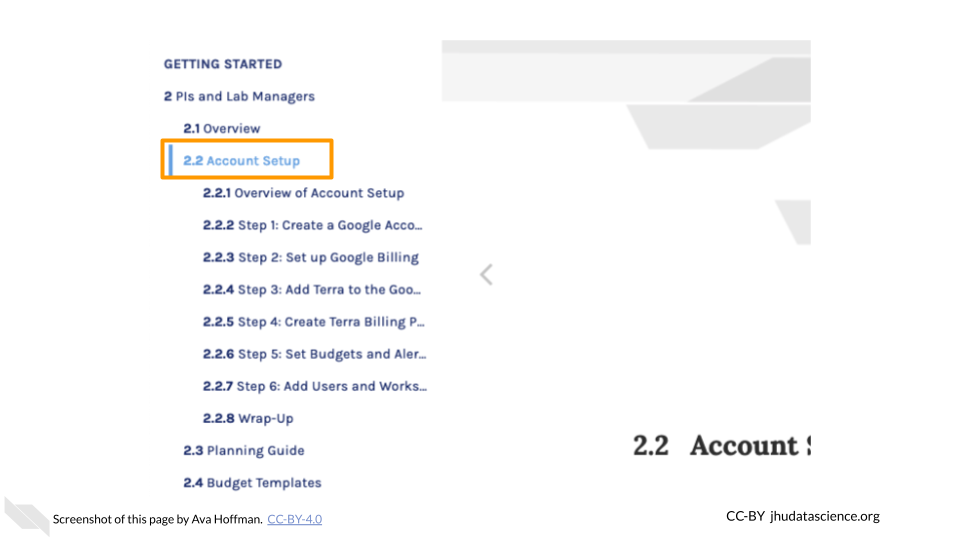

# Introduction 

Welcome to the AnVIL Getting Started guide!  In it you will find step-by-step instructions for setting up your accounts, as well as guides on how to use some of AnVIL’s key features.

### What Is AnVIL?

AnVIL is NHGRI's Genomic Data Science Analysis, Visualization, and Informatics Lab-space.  It provides a platform for performing genomic data analysis on the cloud.

<iframe width="560" height="315" src="https://www.youtube.com/embed/XC5qzj-yZb8" title="YouTube video player" frameborder="0" allow="accelerometer; autoplay; clipboard-write; encrypted-media; gyroscope; picture-in-picture" allowfullscreen></iframe>

### Does AnVIL Cost Money?

Through AnVIL, you pay for computing resources as you use them.  If you'd like to try it out, new users can claim a $300 Google Cloud credit to test out the platform and perform some small analyses.

We also provide a [cost estimator](budget-templates.html#types-of-costs).

### Where Can I Get Help?

Please visit our community support forum at [`help.anvilproject.org`](https://help.anvilproject.org) with any questions (or suggestions!) you may have.

### How to Use This Book

This book is not intended to be read through sequentially, rather, it is a collection of guides that you can reference based on your needs.  It is divided into two major sections:

**Account Setup**

Step-by-step instructions for new AnVIL users to set up their accounts and start using the AnVIL platform.  We have included recommendations for configuring your accounts based on several common use cases:

- **PIs and Lab Managers**: managing a team of researchers working on AnVIL
- **Data Analysts**: joining a team working on AnVIL
- **Consortia**: using AnVIL as part of a research consortium

**Working on AnVIL**

Examples and walkthroughs of common tasks on the AnVIL platform:

- **Workspaces**: how to create and clone research spaces on AnVIL
- **Tools**: how to run common tools including Jupyter Notebooks, Galaxy, and RStudio
- **Data**: how to find and access AnVIL datasets, as well as upload and manage your own data
- **Workflows**: how to find and run existing automated data processing pipelines, and how to customize and share your own

### Activate `scroll_highlight` Feature {#scroll-highlight}

Note that some sections of this book cover steps in a lot of detail. When navigating the table of contents, you can click subsection (e.g., 2.1, 4.3) headers a second time to expand the table of contents and enable the `scroll_highlight` feature. This can help you follow the separate steps within more clearly.

