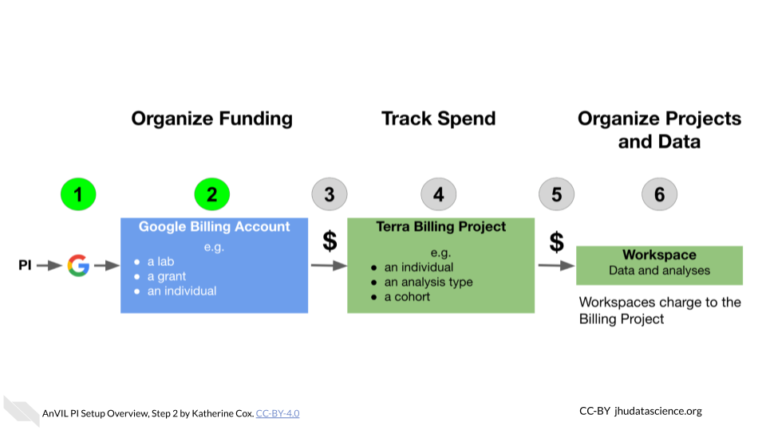
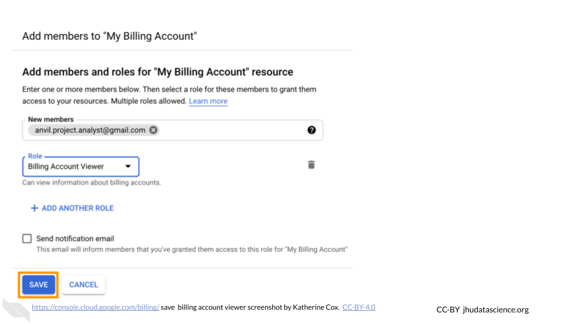
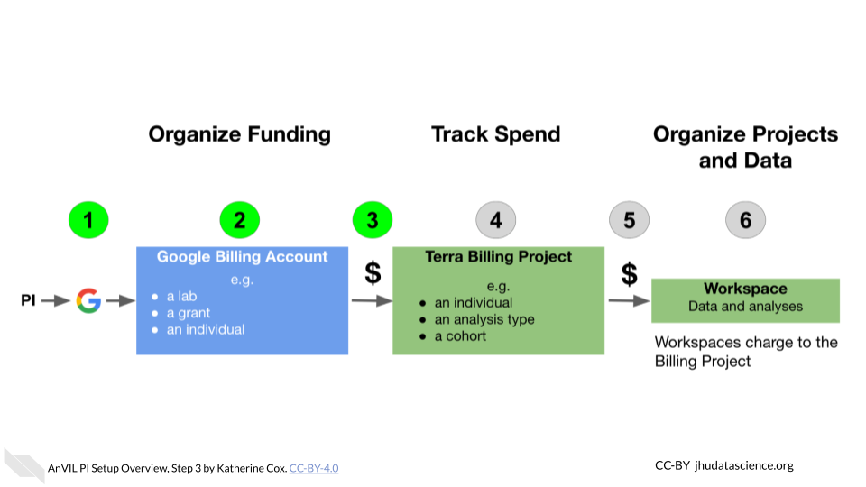
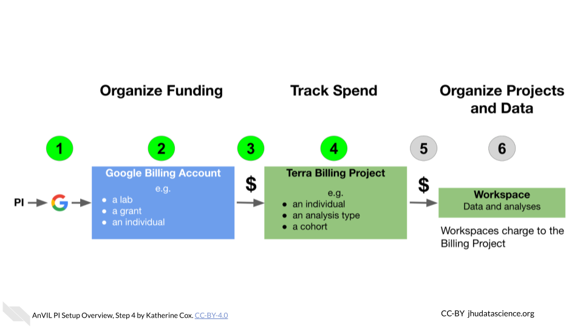
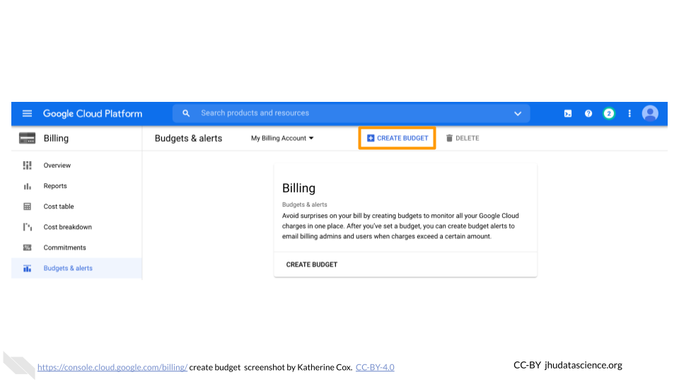
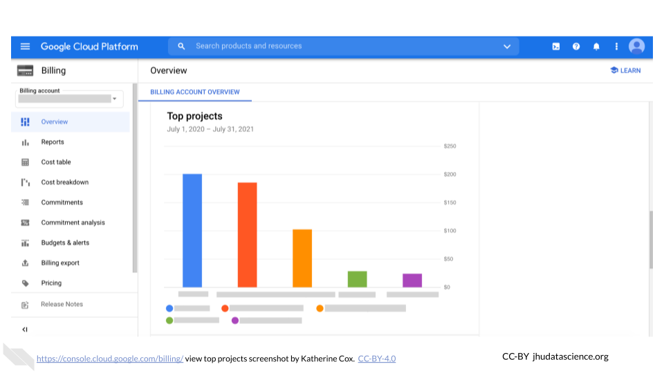
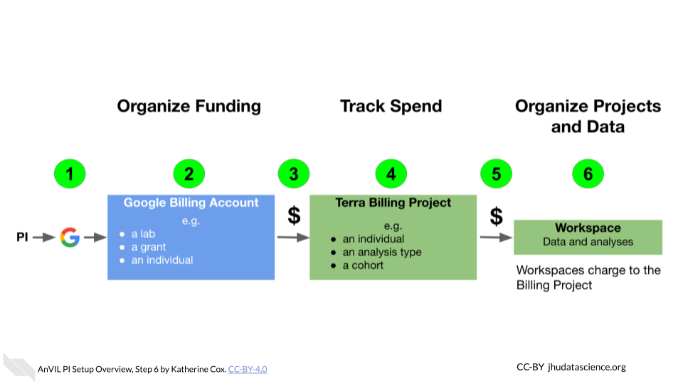
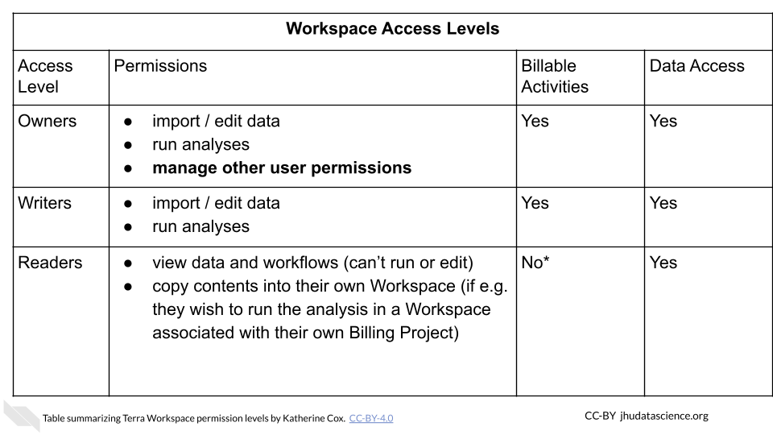

# (PART\*) Account Setup {-}

# PIs and Lab Managers

This chapter is targeted towards people who are responsible for bringing a team to AnVIL. Broadly targeted towards principal investigators (PIs), but also relevant to team leads or lab managers, you will find here:

- **Account Setup Overview** -- Design philosophy and goals for this guide - is this a good fit for your team?  What should you know before you start?
- **Account Setup Steps** -- Step-by-step instructions to create your first accounts on AnVIL and connect your team members

The Appendices of this book contain additional information that may be of interest, including:

- Templates for including AnVIL in grant applications ([Budget Templates], [IRB Templates])
- Information regarding AnVIL's security features for protecting sensitive research ([Authorization Domains])

::: {.fyi}
Please click on the subsection headers in the left hand 
navigation bar (e.g., 2.1, 4.3) a second time to expand the 
table of contents and enable the `scroll_highlight` feature 
([see more](introduction.html#scroll-highlight)).
:::

## Account Setup Overview {#overview-pis}

### Goals for This Guide

### Design Philosophy

This guide provides an opinionated walkthrough on how to set up AnVIL for your lab, based on experiences from many labs actively using AnVIL.  These step-by-step instructions take team leads that are completely new to the AnVIL through account setup to the point where team members can start working on AnVIL.  Following the recommendations in this guide will help you more clearly see where charges are coming from and have greater control over which users can spend your money and access your data.  In support of these goals we have made the following design decisions:

1. COST CONTROL

a. Prevent charges to your funding account until you explicitly give authorization by starting with Google’s free $300 credit program
b. Control who can charge to your account by limiting who can “share” permission to compute - yourself and any designated "Lab Managers"

2. COST TRANSPARENCY

a. Monitor costs by setting up email alerts to warn you when you reach spending thresholds
b. Enable detailed analysis of costs by exporting cost data using BigQuery

3. DATA ACCESS CONTROLS

a. Reduce unwanted access by limiting who can "share" your data and analyses - yourself and any designated "Lab Managers"
b. Stricter data access management can be enforced through "Authorization Domains"; however this can make future sharing and publication difficult.  This guide recommends avoiding Authorization Domains for most uses, especially as you are starting out.  If you are working with highly sensitive data, see [this documentation](https://support.terra.bio/hc/en-us/articles/360026775691-Managing-data-privacy-and-access-with-Authorization-Domains) for more information.

These design decisions are made to help you get up and running as quickly as possible without overwhelming new users.  As your experience and comfort with AnVIL grows, you will likely change your design to better match your unique needs e.g. enabling Authorization Domains when working with protected data.

### Before You Start

- You will need a **credit card or bank account** to activate your free trial and get started.  Don't worry! **You won't be billed until you explicitly turn on automatic billing**, but payment information is needed for verification purposes.
- Before setting up billing yourself, you may want to check with your institutional procurement office and see if they have a preferred account set-up method with Google (such as a third party reseller or an existing account).
- To add lab members, you will need to know the Google account they will use to access Terra.  You can send lab members to the [Data Analysts] chapter for instructions on how they can sign up and start working on AnVIL. You can complete most setup steps without this information and then add them once you know the correct accounts.

### Starting Setup {#account-setup-pis}

AnVIL uses [Terra](https://anvil.terra.bio/) to run analyses.  Terra operates on Google Cloud Platform (GCP), so you’ll pay for all storage and analysis costs through a Google account linked to Terra.  The costs are the standard Google Cloud Platform fees for storing and moving data as well as executing an analysis.  These costs are passed along through Terra without any markup.

1. Create a Google account
1. Set up Google Billing (and claim your free credits!).
    + Add an administrator or viewer (optional)
1. Link Terra to the Google Billing Account
1. Create Terra Billing Project(s)
1. Set budgets and alerts (optional, but highly recommended)
1. Add users and Workspaces

### Lab Management Roles

While there are many ways to configure your lab, this guide defines the following roles and responsibilities:

- **PI** - The PI sets up the lab’s Google Cloud Account, creates its Google Billing Account(s), and Google Payment Method(s), links Terra with GCP, and invites Lab Managers to be Google Cloud “Billing Account Users.”

- **Lab Manager** (Optional) - A Lab Manager creates or clones Terra Workspaces and manages who can use those Workspaces. The Lab Manager is also responsible for creating one or more Terra Billing Projects configuring GCP budgets and alerts.  Importantly, **lab managers control who can spend lab money** and should have an understanding of Google Cloud Billing and Terra Billing Projects.  Depending on your lab, the PI may choose to be the only Lab Manager, or may appoint trusted lab members to assist.

- **Data Analyst** - A lab member who is granted write + can-compute access on one or more Terra Workspaces by a Lab Manager and who will run analyses in Terra.  Data Analysts cannot share Terra Workspaces (this prevents them from enabling others to spend lab money).

## Step 1: Create a Google Account {#pis-step-1}

Terra operates on Google Cloud Platform, so you will need a (free) Google account which will allow you to

- Access the Terra platform to manage team members, data, and analyses
- Access Google Cloud Platform to manage billing
- Receive alerts when spending reaches specified thresholds

If you do not already have a Google account that you would like to use for accessing Terra, [create one now](https://accounts.google.com/SignUp).

If you would like to create a Google account that is associated with your non-Gmail, institutional email address, follow [these instructions](https://support.terra.bio/hc/en-us/articles/360029186611).

## Step 2: Set Up Google Billing

Terra operates on Google Cloud Platform, and does not charge any markup.  Rather than paying Terra or AnVIL, users set up billing directly with Google Cloud Platform.

**Make sure to use the same Google account ID you use to log into Terra for Google Cloud Billing.**

To set up billing, you must first create a **Google “Billing Account”**.
You can create multiple Billing Accounts associated with your Google ID.  We recommend creating separate Billing Accounts for different funding sources.

### Create a Google Billing Account

1. Log in to the [Google Cloud Platform](https://console.cloud.google.com/) console using your Google ID. **Make sure to use the same Google account ID you use to log into Terra.**  

1. If you are a first time user, don’t forget to claim your free credits! If you haven't been to the console before, once you accept the Terms of Service you will be greeted with an invitation to "Try for Free."

    

1. Follow the instructions to sign up for a Billing Account and get your credits. 

1. Choose “Individual Account”. This “billing account” is just for managing billing, so you don’t need to be able to add your lab members. You will need to give either a credit card or bank account for security. Don't worry! **You won't be billed until you explicitly turn on automatic billing**.

    

1. You can view and edit your new Billing Account, by selecting “Billing” from the left-hand menu, or going direction to the billing console [console.cloud.google.com/billing](https://console.cloud.google.com/billing) 

    

1. Clicking on the Billing Account name will allow you to manage the account, including accessing reports, setting alerts, and managing payments and billing.  We will cover account management in greater detail below.

    

At any point, you can create additional Billing Accounts using the **Create Account** button.  We recommend creating a new Billing Account for each funding source.

### Add Users or Viewers (optional)

If you have a project manager or finance administrator who needs access to a Billing Account, you can add them with a few different levels of permissions.  Generally the most useful are:

- **Users** have a great deal of power over spending - they can create new "Billing Projects" and control who can spend money on those projects.  If you have a lab or accounts manager responsible for expenses, it may make sense to add them as a Billing Account User.  If you wish to retain full control over who can spend money on GCP, you should not add any Users.
- **Viewers** can see the activity in the Billing Account but can’t make any changes.  This can be useful for finance staff who need access to the reports, or for lab members to be able to see what their analyses are costing.

Anyone you wish to add to the Billing Account will need their own Google ID.

To add a member to a Billing Project:
  
1. Log in to the [Google Cloud Platform](https://console.cloud.google.com/) console using your Google ID.
1. Navigate to [Billing](https://console.cloud.google.com/billing)

    

1. You may be automatically directed to view a specific Billing Account.  If you see information about a single account rather than a list of your Billing Accounts, you can get back to the list by clicking "Manage Billing Accounts" from the drop-down menu.

    

1. Check the box next to the Billing Account you wish to add a member to, click "ADD MEMBER".

    

1. Enter their Google ID in the text box. In the drop-down menu, mouse over Billing, then choose the appropriate role.

    

1. Click "SAVE".

    

## Step 3: Add Terra to Google Billing Account

This gives Terra permission to create projects and send charges to the Google Billing Account, and must be done by an administrator of the Google Billing Account.

Terra needs to be added as a "Billing Account User":

1. Log in to the [Google Cloud Platform](https://console.cloud.google.com/) console using your Google ID.
1. Navigate to [Billing](https://console.cloud.google.com/billing)

    

1. You may be automatically directed to view a specific Billing Account.  If you see information about a single account rather than a list of your Billing Accounts, you can get back to the list by clicking "Manage Billing Accounts" from the drop-down menu.
 
    

1. Check the box next to the Billing Account you wish to add Terra to, click "ADD MEMBER".

    

1. Enter `terra-billing@terra.bio` in the text box.  In the drop-down menu, mouse over Billing, then choose "**Billing Account User**".

    

1. Click "SAVE".

    

## Step 4: Create Terra Billing Project(s)

This is how you enable Terra users to charge to the Google Billing Account.

### Create a Billing Project

1. [Launch Terra](https://anvil.terra.bio/#workspaces) and sign in with your Google account.  **Make sure to use the same Google account that you used to set up Google Billing.** If this is your first time logging in to Terra, you will need to accept the Terms of Service.

1. In the drop-down menu on the left, navigate to "Billing". Click the triple bar in the top left corner to access the menu. Click the arrow next to your name to expand the menu, then click "Billing".

    

1. On the Billing page, click the "+ CREATE" button to create a new Billing Project. If prompted, select the Google account to use.  Make sure to use the same Google account that you used to set up Google Billing. If prompted, give Terra permission to manage Google Cloud Platform billing accounts.

    

1. Enter a unique name for your Terra Billing Project and select the appropriate Google Billing Account. The name of the Terra Billing Project must:
    + Only contain lowercase letters, numbers and hyphens
    + Start with a lowercase letter
    + Not end with a hyphen
    + Be between 6 and 30 characters
    + Be unique across all Google Billing Projects

    

The page doesn't always update as soon as the billing project is created.  If it's been a couple of minutes and you don't see a change, try refreshing the page.

When starting out, a single Billing Project is generally sufficient.  As you and your team grow comfortable with AnVIL, you may find it useful to create additional Billing Projects to organize your spending. Multiple Billing Projects can all be associated with the same Google Billing Account if they are all funded by the same source.

**Having trouble?**

- Check out the [Troubleshooting] appendix
- Visit our community support forum at [`help.anvilproject.org`](https://help.anvilproject.org) with any questions.

## Step 5: Set Budgets and Alerts

Cloud computing can save a great deal of money, time and effort by providing compute on an as-needed basis.  However, care must be taken that users do not accidentally request excessive resources, or leave resources running when not needed.

Unfortunately, there are two issues that make direct cost control difficult:

- **The Google Cloud billing interface does not provide a way to automatically cancel computations when a spending threshold is reached**
- **Compute costs are reported with a delay (~1 day)**

As a PI or lab manager, there are some steps you can take to help monitor and limit spending:

- Be careful with members and permissions in your Billing Projects and Workspaces on Terra (see [Adding Users and Workspaces](#step-6-add-users-and-workspaces) for recommended setup)
- Most importantly, **monitor your spending** so you can shut down unnecessary expensive activities before they have time to accumulate.
- Terra provides [extensive documentation and examples](https://support.terra.bio/hc/en-us/sections/360006459511-Controlling-Cloud-costs) regarding cost management while working in the cloud

**We highly recommended you set budgets and alerts to notify you if spending starts to exceed expectations**.  This will make it easier to notice and shut down any accidental overspending.  A good starting point is to set a monthly budget, and then set alerts at **50 percent** and **90 percent** of expected spend.  You can add additional alerts if you desire.

You can set a single Budget for your entire lab, set up budgets for individual Workspaces, or even set budgets for certain subsets of Workspaces.  This will depend on the size of your lab and how closely you want to monitor spending.  More granular budgets make it quicker to notice and track down overspending from a particular project but mean you will get more emails every month.  When setting budgets with broader scope, you can always find out which particular Billing Project is spending the money by checking in the GCP Billing interface.  **NOTE: that there may be some restrictions on the budgets and alerts you can set while you’re using GCP’s free credits.**  At the time of writing (Feb 2021) you are not able to set budgets for individual projects while you are using the GCP free credits, but can still set an overall budget.  Any restrictions should be lifted when you upgrade to a paid account.

### Set Alerts

1. Log in to the [Google Cloud Platform](https://console.cloud.google.com/) console using the Google ID associated with your Google Cloud projects.

1. Open the dropdown menu on the top left and click on [Billing](https://console.cloud.google.com/billing).

    

1. You may be automatically directed to view a specific Billing Account. If you see information about a single account (and it’s not the one you’re interested in), you can get back to the list of all your Billing Accounts by clicking "Manage Billing Accounts" from the drop-down menu.

    

1. Click on the name of the Billing Account you want to set alerts for.

    

1. In the left-hand menu, click "Budgets & alerts".
 
    

1. Click the "Create Budget" tab.

    

1. Enter a name for your budget, and then choose which projects you want to monitor. Then click "Next".

    

1. For Budget Type, select "Specified amount". Enter the total budget amount for the month (you will set alerts at different thresholds in the next step). Click "**Next**" (do not click "Finish").

    

1. Enter the threshold amounts where you want to receive an alert. We recommend starting with 50% and 90%. You can set other alerts if you prefer.

    

1. Check the box for "Email alerts to billing admins and users", then click "**Finish**". Now you (as the owner and admin), along with anyone you added with admin or user privileges (e.g. lab managers) will receive alerts when your lab members reach the specified spending thresholds. These emails will be sent to the Gmail accounts associated with the Billing Account.

    

1. You can edit your budgets at any time by going to Billing > Budgets & alerts, and clicking on the name of the budget you want to edit.

    

### View spend

You can always check your current spend through the Google Billing console, but remember

- There is a reporting delay (~1 day), so you cannot immediately see what an analysis cost
- Costs are reported at the level of Billing Projects, so if you have not created separate Billing Projects, you will not be able to determine where charges are coming from.

The Google Billing console displays information by Billing Account.  To view spending:
  
1. Log in to the [Google Cloud Platform](https://console.cloud.google.com/) console using the Google ID associated with your Google Cloud projects.

1. Open the dropdown menu on the top left and click on [Billing](https://console.cloud.google.com/billing).

    

1. You may be automatically directed to view a specific Billing Account. If you see information about a single account (and it’s not the one you’re interested in), you can get back to the list of all your Billing Accounts by clicking "Manage Billing Accounts" from the drop-down menu.

    

1. Click on the name of the Billing Account for the project you want to view.

    

1. Look at the top of the **Overview** tab to see your month-to-date spending.
    
    

1. Scroll further down the **Overview** tab to show your top projects.
    
    

1. Click on the **Reports** tab to see more detailed information about each of your billing projects.  This is probably the most useful tab for exploring costs of individual projects over time.

    

1. Click on the **Cost table** tab to obtain a convenient table of spending per project.
    
    

### Export Cost Data to BigQuery

Coming soon -- instructions on how to export your cost data so you can better analyze and control your expenses.

## Step 6: Add Users and Workspaces

Finally, back on Terra, you can add lab members and give them permission to run analyses funded through your Billing Projects.

There are two primary ways to permit users to charge to your Billing Projects:

- **Add them directly to the Billing Project**.  This gives them flexibility to create and manage their own Workspaces, but reduces your control over spending.   Anyone they add to their Workspaces with sufficient permissions (i.e. permission to compute) can charge to your Billing Project.
- **Create a Workspace yourself, and add them to the Workspace** (or have a designated Lab Manager responsible for managing Workspaces).  This gives you much more control over who can charge to your Billing Project.

Billing permissions on Terra can be confusing.  For this reason, **We recommend starting by having a single person responsible for managing all Workspaces (either yourself or a trusted "lab manager").  This person should create all Workspaces and add lab members as Writers (not Owners) to the Workspaces**.  This provides the greatest control over spending.  Once you are familiar with the permissions system and are certain your lab members understand the implication of different permission settings, you may decide to give them greater control over Workspace access.

### Create a New Workspace

1. [Launch Terra](https://anvil.terra.bio/#workspaces)

1. In the drop-down menu on the left, navigate to "Workspaces". Click the triple bar in the top left corner to access the menu. Click "Workspaces".

    

1. Click on the **plus icon** near the top of left of the page.

    

1. Name your Workspace and select the appropriate Billing Project.  **All activity in the Workspace will be charged to this Billing Project** (regardless of who conducted it).

    

1. If you are working with protected data, you can set the **Authorization Domain** to limit who can be added to your Workspace.  Note that the Authorization Domain cannot be changed after the Workspace is created (i.e. there is no way to make this Workspace shareable with a larger audience in the future).  Workspaces by default are only visible to people you specifically share them with.  Authorization domains add an extra layer of enforcement over privacy, but by nature make sharing more complicated.  We recommend using Authorization Domains in cases where it is extremely important and/or legally required that the data be kept private (e.g. protected patient data, industry data).  For data you would merely prefer not be shared with the world, we recommend relying on standard Workspace sharing permissions rather than Authorization Domains, as Authorization Domains can make future collaborations, publications, or other sharing complicated.

    

1. Click "CREATE WORKSPACE".  The new Workspace should now show up under your Workspaces.

    

**To start, we recommend creating one Workspace for each lab member** (associated with that lab member’s Billing Project, with separate Billing Projects for your lab members).  This will enable you and your lab members to familiarize yourself with Workspaces and decide how best to organize your work.  You can then create additional Workspaces as needed.

### Add Members to Workspaces

Lab members must have logged in to Terra at least once before they can be added to your Billing Projects and Workspaces (they do not need to log in to Google Cloud Console).  You can send lab members to the [Data Analysts] guide for instructions on how they can sign up and start working on AnVIL.

Lab members can be added to a Workspace with a few different permission levels:

- **Readers** can view the Workspace but not make edits or run analyses (i.e. they **cannot spend your money**)
- **Writers** can make edits and run analyses (i.e. they **can spend your money**)
- **Owners** can make edits and run analyses and can also manage the permissions of other users (i.e. they **can enable others to spend your money**)

More details about the permissions associated with each Access Level can be found in the [Terra documentation](https://support.terra.bio/hc/en-us/articles/360025851892-Reader-writer-or-owner-Workspace-access-controls-explained).

Managing permissions for a Workspace has important implications:

- **Billing**: Terra charges are associated with Workspaces rather than users.  Any billable activity that takes place in a given Workspace will be charged to the associated Billing Project, regardless of who conducted the activity.  If there are multiple users with permission to compute, it is impossible to tell who conducted the activity.
- **Data access**: Especially when working with protected data, it’s important to ensure that users have proper authorization to view the data before giving them access to a Workspace containing the data.  Terra provides **Authorization Domains** to assist with this.

In general we recommend:

- **Writers: Lab members who need permission to compute** (and charge to your Billing Project).  This gives them permission to freely use the Workspace, (adding and removing data, conducting analyses, etc.) but prevents them from adding additional members who could charge to your Billing Project. This ensures you have control over *who* is doing the spending.
- **Readers: All other users** (i.e. users who need to see the Workspace but should not charge to your Billing Project).  Readers can always “clone” the Workspace (creating a copy of it associated with their own Billing Project) if they want to run computations themselves.
- If working with protected data, take advantage of Authorization Domains to increase security.

To add a member to a Workspace:

1. [Launch Terra](https://anvil.terra.bio/#workspaces)

1. In the drop-down menu on the left, navigate to "Workspaces". Click the triple bar in the top left corner to access the menu. Click "Workspaces".

    

1. Click on the name of the Workspace to open the Workspace. Opening a Workspace does not cost anything.  Certain activities in the Workspace (such as running an analysis) will charge to the Workspace’s Billing Project.  Workspace management (e.g. adding and removing members, editing the description) does not cost money.

    

1. Click the circle with 3 dots on the right hand side to open the Workspace management menu.  Click "Share"

    

1. Enter the email address of the user you want to share the Workspace with.  This must be the address associated with the account they are using to access Terra.

    

1. Choose their permission level.

    - Remember that all activity in the Workspace will be charged to the Workspace's Billing Project, regardless of who conducts it, so only add members as "Writers" or "Owners" if they should be charging to the Workspace's Billing Project.
    - "Readers" can view all parts of the Workspace but cannot make edits or run analyses (i.e. they cannot spend money).  They can also clone their own copy of the Workspace where they can conduct activity on their own Billing Project.

    

1. Click "Save".  The user should now be able to see the Workspace when logged in to Terra.

    

### Request Quota Increase

To prevent abuse, new users of GCP are only permitted to create a few Google Cloud "Projects".  When working on Terra, each Terra Workspace is associated with its own Google Cloud Project, so if your team has multiple members you can bump up against this limit fairly quickly and won't be able to create more Workspaces.

Since this limit is imposed by Google, you will need to contact them directly to request a quota increase, using [this form](https://support.google.com/code/contact/billing_quota_increase).

At the time of writing (April 2022) Terra is working to expedite this process for Terra users; we recommend checking the [relevant Terra documentation](https://support.terra.bio/hc/en-us/articles/360029071251#h_01FFNCK82NB0YMAH5BTP41GYSY) for the latest information as well as recommendations about how to fill out the form.

## Wrap-Up {#pis-wrap-up}

**Congratulations!  You have successfully set up AnVIL for your lab!**

Your lab members should be free to carry out analyses in the Workspaces you created.  You should not need to do any further configuration through Terra until you decide to add or change user permissions for your Billing Projects and Workspaces.

You can view costs at any time through [Google Cloud Billing](https://console.cloud.google.com/billing).  Note that costs are reported with a delay (~1 day).

