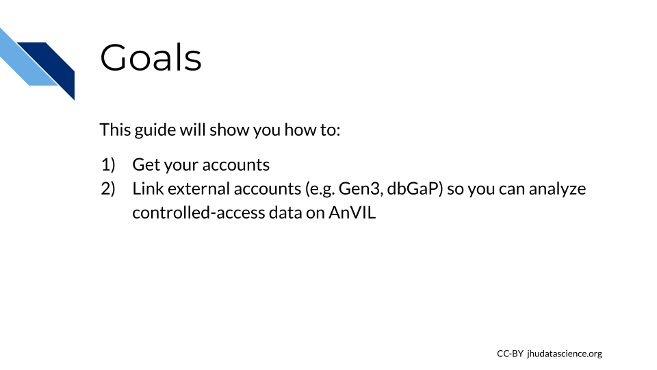
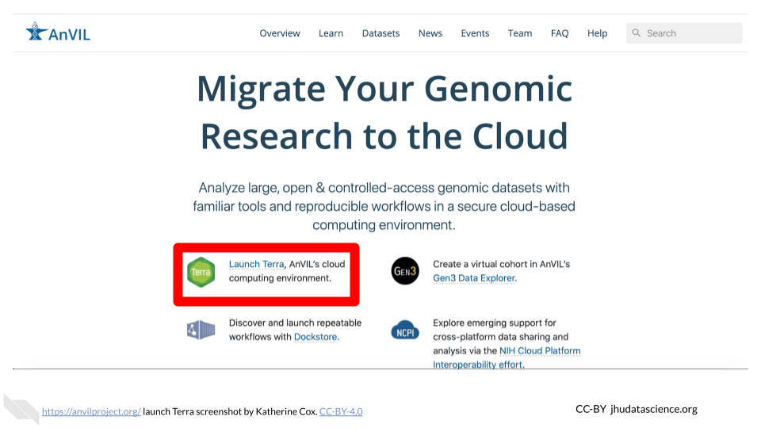

# Data Analysts

This chapter is targeted towards people who are joining an existing team on AnVIL. You will find here:

 
<!-- The capital letter above alters the formatting for the bullet points below -->

- **Account Setup Overview** -- Introductory information and goals for this guide
- **Account Setup Steps** -- Step-by-step instructions to create your first accounts on AnVIL

## Account Setup Overview {#overview-analysts}

### Goals for This Guide

### Starting Setup

**Terra** is the compute engine of AnVIL; i.e. where you will run your analyses.  Terra currently offers access to **Jupyter Notebooks** and **RStudio** for interactive analysis, as well as the **Workflow Description Language** (WDL) for batch processing of many samples.  Behind the scenes, Terra runs on Google Cloud Platform, so you will need a (free) Google Account.

In this guide, you will go through the following steps:

1. Create a Google account
1. [Launch Terra](https://anvil.terra.bio/#workspaces) and sign in with your Google account
1. Link external accounts (Gen3, dbGaP) to Terra (optional - enables you to import AnVIL open access datasets and to access protected data if you have appropriate authorization)

## Step 1: Create a Google Account {#data-analysts-step-1}

Terra operates on Google Cloud Platform, so you will need a (free) Google account to create a Terra account and run analyses on AnVIL.

If you do not already have a Google account that you would like to use for accessing Terra, [create one now](https://accounts.google.com/SignUp).

If you would like to create a Google account that is associated with your non-Gmail, institutional email address, follow [these instructions](https://support.terra.bio/hc/en-us/articles/360029186611).

## Step 2: Set Up Terra

[Launch Terra](https://anvil.terra.bio/#workspaces), and you should be prompted to sign in with your Google account.

- Once you have signed in, your Terra account is set up and your PI or manager should be able to add you to projects and/or Workspaces.
- If this is the **first time you or your team has used Terra**, the PI or manager will also need to set up billing.

You can always access Terra by going to [`anvil.terra.bio`](https://anvil.terra.bio/), or by clicking the link on the AnVIL home page.

## Step 3: Link External Accounts (optional)

AnVIL provides access to a wide selection of datasets, including controlled-access data.  Linking your accounts will enable you to import these data into Terra.

The following links will take you to the Terra documentation for setting up and linking external accounts.

- [Set up a Gen3 account](https://gen3.theanvil.io/login) - allows you to use the Gen3 data explorer to create artificial cohorts over AnVIL datasets that have been indexed by Gen3.
- [Link Gen3 and Terra accounts](https://support.terra.bio/hc/en-us/articles/360050390451) - allows you to analyze Gen3 data on Terra.
- [Link Terra and eRA Commons ID](https://support.terra.bio/hc/en-us/articles/360038086332-Linking-Terra-to-External-Servers) - To use controlled-access data on Terra, you will need to link your Terra user ID to your authorization account (such as a dbGaP account). Linking to external servers will allow Terra to automatically determine if you can access controlled datasets hosted in Terra (ex. TCGA, TOPMed, etc.) based on your approved dbGaP applications.

## Wrap-Up {#data-analysts-wrap-up}

**Congratulations! You have successfully set up your AnVIL account!**

Your PI or lab manager should be now be able to add you to Workspaces so that you can perform analyses. Please contact your PI or manager to coordinate your user permissions for Terra Projects and Workspaces.

To learn more about how to perform analyses on AnVIL, see the **Working on AnVIL** section of this book.

- The [Workspaces] chapter introduces AnVIL Workspaces, the fundamental unit of research organization on AnVIL. All analyses on AnVIL are performed in a Workspace.
- The [Tools], [Data], and [Workflows] chapters explain how to perform a variety of common research tasks on AnVIL.
