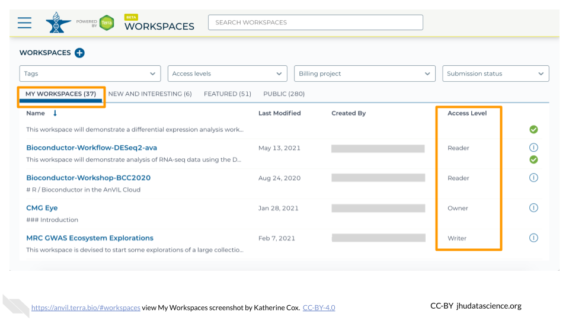
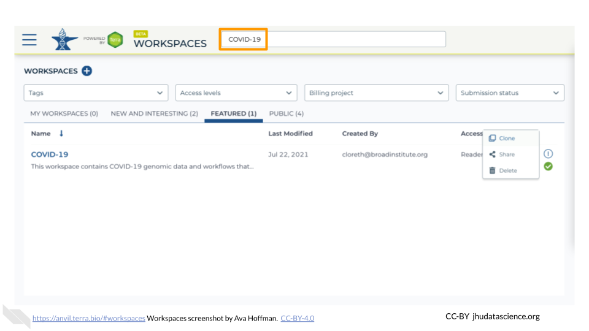
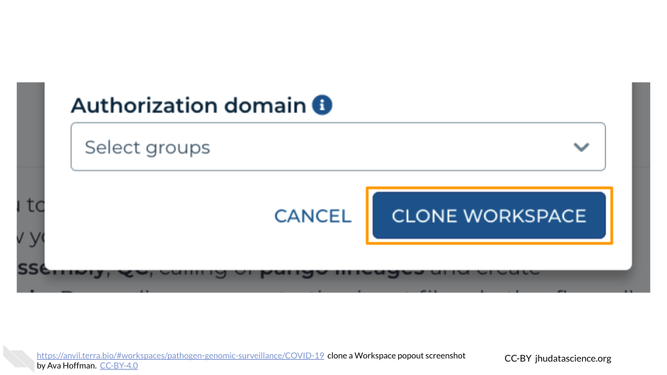
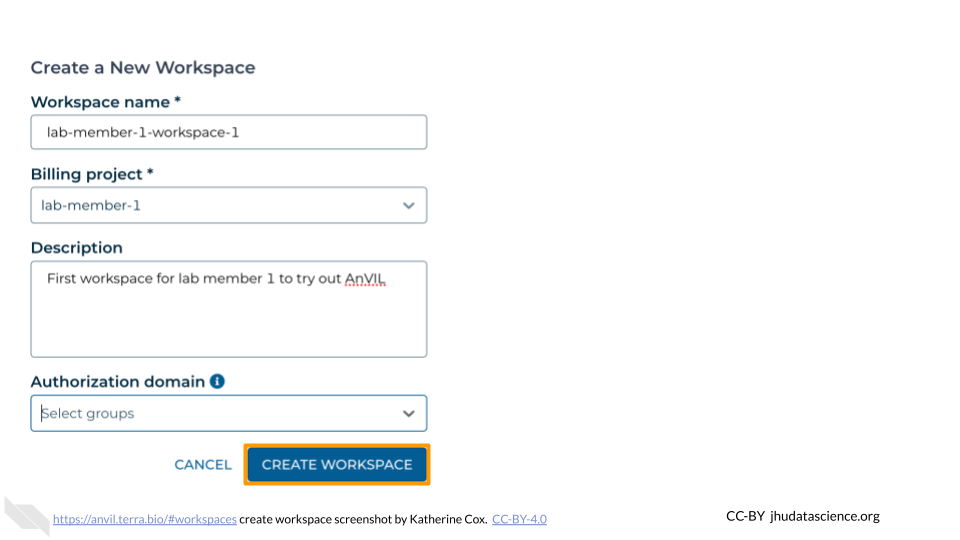
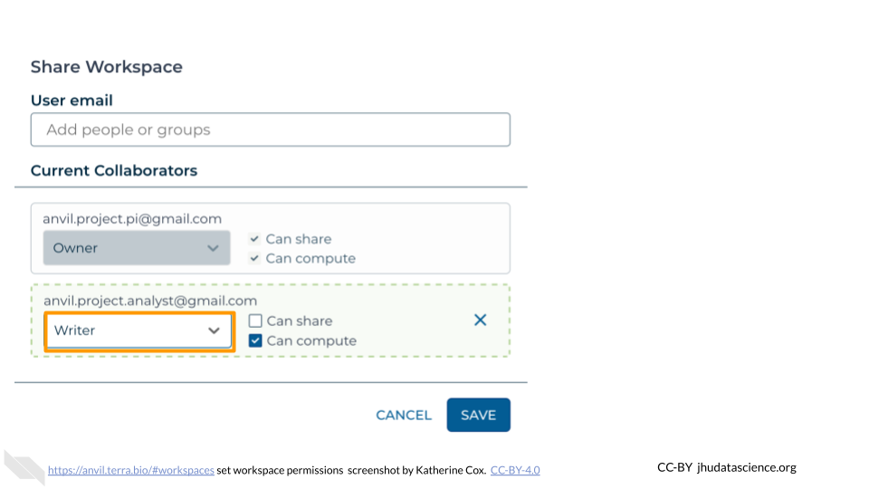

# (PART\*) Working on AnVIL {-}

# Workspaces

Workspaces are the building blocks of projects in Terra. Inside a Workspace, you can run analyses, launch interactive tools like RStudio and Galaxy, store data, and share results. 

To get a Workspace of your own, you can

- **Clone a Workspace**: Cloning an existing Workspace allows you to copy existing documentation, code, and/or data into your own experimental space.
- **Create a Workspace**: Creating a new Workspace from scratch allows you to fully customize the contents.

The video below gives a brief introduction to the parts of a Workspace.

<iframe src="https://drive.google.com/file/d/18WUmQfDnulHdaMlrH0Eh6kwIP3zTkaqp/preview" width="640" height="360" allow="autoplay"></iframe>

## Access Your Workspaces

If you are part of a research team, you may have been added to some existing Workspaces.  To find and access your Workspaces, follow the steps below.

1. [Launch Terra](https://anvil.terra.bio/#workspaces)

1. In the drop-down menu on the left, navigate to "Workspaces". Click the triple bar in the top left corner to access the menu. Click "Workspaces".

    

1. You are automatically directed to the "My Workspaces" tab.  Here you can see any Workspaces that have been shared with you, along with your permission level.

    
   
    - **Reader** means you can open the Workspace and see everything, but can't do any computations or make any edits.
    - **Writer** means you can run computations, which will charge costs to the Workspace's Billing Project.  Writers can also make edits to the Workspace.
    - **Owner** is similar to Writer, but also allows you to control who can access the Workspace.
    
1. Click on the name of a Workspace to open it.  Opening and viewing a Workspace does not cost anything.

    

1. When you open a Workspace, you are directed to the Workspace Dashboard.  This generally has a description of the Workspace contents, as well as some useful details about the Workspace itself.

    

From here you can navigate through the different tabs of the Workspace, and if you have sufficient permission, you can start running analyses.  If you are only a Reader, you may need to "clone" (make your own copy) of the Workspace before you can start working.

## Clone an Existing Workspace {#clone-workspace}

Cloning an existing Workspace allows you to copy existing documentation, code, and/or data into your own experimental space.

Cloning creates a new copy of the Workspace that will charge costs to the Billing Project of your choice. Note that you can only clone a Workspace if you are at least a "User" on the Terra Billing Project.  This helps prevent unwanted charges.  Workspaces charge money to their associated Billing Project, regardless of who conducts the activity, so it's important to be careful about who has permission to use the Workspace (see [Add Members to Workspace] for details).

If you need to clone a Workspace but don't have permission to create your own Workspaces, contact your PI or lab manager so that they can either grant you permission or clone the Workspace for you.

The following steps show you how to clone a Workspace that has already been developed by other AnVIL users. When cloning, AnVIL makes a copy of notebooks and code for you to modify. Data however, is linked back to the original Workspace through Data Tables, which saves space!

1. [Launch Terra](https://anvil.terra.bio/#workspaces)

1. Locate the Workspace you want to clone. If a Workspace has been shared with you ahead of time, it will appear in "MY WORKSPACES". You can clone a Workspace that was shared with you to perform your own analyses. In the screenshot below, no Workspaces have been shared.

    

1. If a Workspace hasn't been shared with you, navigate to the "FEATURED" or "PUBLIC" Workspace tabs.

    
    
1. Use the search box to find the Workspace you want to clone.

    
    
1. Click the teardrop button on the far right next to the Workspace you want to clone. Click "Clone". You can also clone the Workspace from the Workspace Dashboard instead of the search results.

    
    
    
1. You will see a popup box appear. Name your Workspace and select the appropriate Terra Billing Project.  **All activity in the Workspace will be charged to this Billing Project** (regardless of who conducted it). Remember that each Workspace should have its own Billing Project.

    

1. If you are working with protected data, you can set the **Authorization Domain** to limit who can be added to your Workspace.  Note that the Authorization Domain cannot be changed after the Workspace is created (i.e. there is no way to make this Workspace shareable with a larger audience in the future).  Workspaces by default are only visible to people you specifically share them with.  Authorization domains add an extra layer of enforcement over privacy, but by nature make sharing more complicated.  We recommend using Authorization Domains in cases where it is extremely important and/or legally required that the data be kept private (e.g. protected patient data, industry data).  For data you would merely prefer not be shared with the world, we recommend relying on standard Workspace sharing permissions rather than Authorization Domains, as Authorization Domains can make future collaborations, publications, or other sharing complicated.

    
    
1. Click "CLONE WORKSPACE".  The new Workspace should now show up under your Workspaces.

    

## Create a New Workspace

Creating a new Workspace from scratch allows you to fully customize the contents.

Note that you can only create a new Workspace if you are at least a "User" on a Terra Billing Project.  This helps prevent unwanted charges.  Workspaces charge money to their associated Billing Project, regardless of who conducts the activity, so it's important to be careful about who has permission to use the Workspace (see [Add Members to Workspace] for details).

If you need to create a Workspace but don't have permission, contact your PI or lab manager so that they can either grant you permission or create the Workspace for you.

The following steps show you how to create a Workspace so you can get started.

1. [Launch Terra](https://anvil.terra.bio/#workspaces)

1. In the drop-down menu on the left, navigate to "Workspaces". Click the triple bar in the top left corner to access the menu. Click "Workspaces".

    

1. Click on the **plus icon** near the top of left of the page.

    

1. Name your Workspace and select the appropriate Billing Project.  **All activity in the Workspace will be charged to this Billing Project** (regardless of who conducted it).

    

1. If you are working with protected data, you can set the **Authorization Domain** to limit who can be added to your Workspace.  Note that the Authorization Domain cannot be changed after the Workspace is created (i.e. there is no way to make this Workspace shareable with a larger audience in the future).  Workspaces by default are only visible to people you specifically share them with.  Authorization domains add an extra layer of enforcement over privacy, but by nature make sharing more complicated.  We recommend using Authorization Domains in cases where it is extremely important and/or legally required that the data be kept private (e.g. protected patient data, industry data).  For data you would merely prefer not be shared with the world, we recommend relying on standard Workspace sharing permissions rather than Authorization Domains, as Authorization Domains can make future collaborations, publications, or other sharing complicated.

    

1. Click "CREATE WORKSPACE".  The new Workspace should now show up under your Workspaces.

    

## Add Members to Workspace

Members can be added to a Workspace with a few different permission levels:

More details about the permissions associated with each Access Level can be found in the [Terra documentation](https://support.terra.bio/hc/en-us/articles/360025851892-Reader-writer-or-owner-Workspace-access-controls-explained).

Managing permissions for a Workspace has important implications:

- **Billing**: Terra charges are associated with Workspaces rather than users.  Any billable activity that takes place in a given Workspace will be charged to the associated Billing Project, regardless of who conducted the activity.  If there are multiple users with permission to compute, it is impossible to tell who conducted the activity.
- **Data access**: Especially when working with protected data, it’s important to ensure that users have proper authorization to view the data before giving them access to a Workspace containing the data.  Terra provides **Authorization Domains** to assist with this.

Make sure you understand what permissions you are granting before adding someone to your Workspace.

To add a member to a Workspace:

1. [Launch Terra](https://anvil.terra.bio/#workspaces)

1. In the drop-down menu on the left, navigate to "Workspaces". Click the triple bar in the top left corner to access the menu. Click "Workspaces".

    

1. Click on the name of the Workspace to open the Workspace. Opening a Workspace does not cost anything.  Certain activities in the Workspace (such as running an analysis) will charge to the Workspace’s Billing Project.  Workspace management (e.g. adding and removing members, editing the description) does not cost money.

    

1. Click the teardrop button ({width=25px}) on the right hand side to open the Workspace management menu.  Click "Share"

    

1. Enter the email address of the user or Group you’d like to share the Workspace with.
    - If adding an individual, make sure to enter the account that they use to access AnVIL.
    - If adding a Terra Group, use the Group email address, which can be found on the Terra Group management page.

    

1. Choose their permission level.

    - Remember that all activity in the Workspace will be charged to the Workspace's Billing Project, regardless of who conducts it, so only add members as "Writers" or "Owners" if they should be charging to the Workspace's Billing Project.
    - "Readers" can view all parts of the Workspace but cannot make edits or run analyses (i.e. they cannot spend money).  They can also clone their own copy of the Workspace where they can conduct activity on their own Billing Project.

    

1. Click "Save".  The user should now be able to see the Workspace when logged in to Terra.

    
