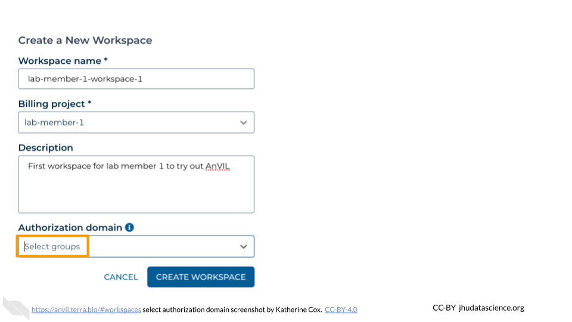
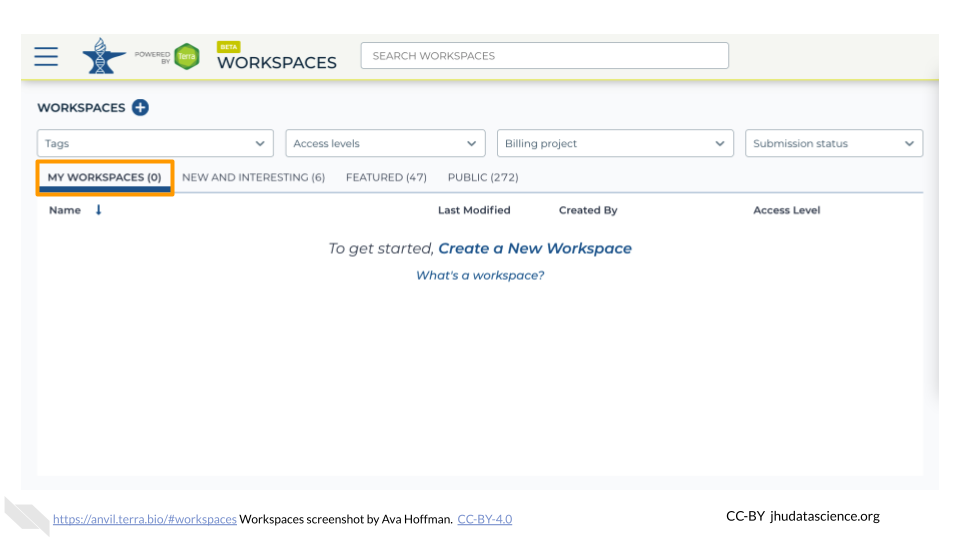

# (PART\*) Working on AnVIL {-}

# Workspaces

Workspaces are the building blocks of projects in Terra. Inside a Workspace, you can run analyses, launch interactive tools like RStudio and Galaxy, store data, and share results. The video below gives a brief introduction to the parts of a Workspace.

<iframe src="https://drive.google.com/file/d/18WUmQfDnulHdaMlrH0Eh6kwIP3zTkaqp/preview" width="640" height="360" allow="autoplay"></iframe>

## Create a New Workspace

Creating a new Workspace from scratch allows you to fully customize the contents. The following steps show you how to create a Workspace so you can get started.

1. [Launch Terra](https://anvil.terra.bio/#workspaces)

1. In the drop-down menu on the left, navigate to "Workspaces". Click the triple bar in the top left corner to access the menu. Click "Workspaces".

    

1. Click on the **plus icon** near the top of left of the page.

    

1. Name your Workspace and select the appropriate Billing Project.  **All activity in the Workspace will be charged to this Billing Project** (regardless of who conducted it).

    

1. If you are working with protected data, you can set the **Authorization Domain** to limit who can be added to your Workspace.  Note that the Authorization Domain cannot be changed after the Workspace is created (i.e. there is no way to make this Workspace shareable with a larger audience in the future).  Workspaces by default are only visible to people you specifically share them with.  Authorization domains add an extra layer of enforcement over privacy, but by nature make sharing more complicated.  We recommend using Authorization Domains in cases where it is extremely important and/or legally required that the data be kept private (e.g. protected patient data, industry data).  For data you would merely prefer not be shared with the world, we recommend relying on standard Workspace sharing permissions rather than Authorization Domains, as Authorization Domains can make future collaborations, publications, or other sharing complicated.

    

1. Click "CREATE WORKSPACE".  The new Workspace should now show up under your Workspaces.

    

## Clone an Existing Workspace {#clone-workspace}

Cloning an existing Workspace allows you to copy existing documentation, code, and/or data into your own experimental space. That following steps show you how to clone a Workspace that has already been developed by other AnVIL users. When cloning, AnVIL makes a copy of notebooks and code for you to modify. Data however, is linked back to the original Workspace through Data Tables, which saves space!

1. [Launch Terra](https://anvil.terra.bio/#workspaces)

1. Locate the Workspace you want to clone. If a Workspace has been shared with you ahead of time, it will appear in "MY WORKSPACES". You can clone a Workspace that was shared with you to perform your own analyses. In the screenshot below, no Workspaces have been shared.

    

1. If a Workspace hasn't been shared with you, navigate to the "FEATURED" or "PUBLIC" Workspace tabs.

    
    
1. Use the search box to find the Workspace you want to clone.

    
    
1. Click the teardrop button on the far right next to the Workspace you want to clone. Click "Clone". You can also clone the Workspace from the Workspace Dashboard instead of the search results.

    
    
    
1. You will see a popup box appear. Name your Workspace and select the appropriate Terra Billing Project.  **All activity in the Workspace will be charged to this Billing Project** (regardless of who conducted it). Remember that each Workspace should have its own Billing Project.

    

1. If you are working with protected data, you can set the **Authorization Domain** to limit who can be added to your Workspace.  Note that the Authorization Domain cannot be changed after the Workspace is created (i.e. there is no way to make this Workspace shareable with a larger audience in the future).  Workspaces by default are only visible to people you specifically share them with.  Authorization domains add an extra layer of enforcement over privacy, but by nature make sharing more complicated.  We recommend using Authorization Domains in cases where it is extremely important and/or legally required that the data be kept private (e.g. protected patient data, industry data).  For data you would merely prefer not be shared with the world, we recommend relying on standard Workspace sharing permissions rather than Authorization Domains, as Authorization Domains can make future collaborations, publications, or other sharing complicated.

    
    
1. Click "CLONE WORKSPACE".  The new Workspace should now show up under your Workspaces.

    
