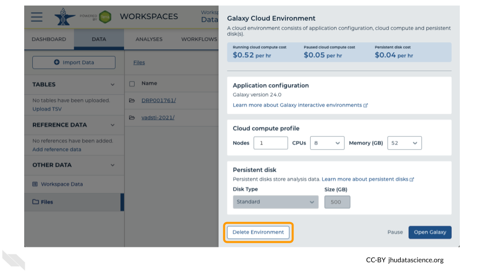

# Galaxy

One of the analysis platforms available on AnVIL is Galaxy. This platform offers a graphical interface for thousands of tools(https://anvilproject.org/learn/interactive-analysis/getting-started-with-galaxy). This chapter focuses on launching and highlighting a few features for Galaxy.

## Galaxy: Video tutorial

Here is a video tutorial that describes the basics of using Galaxy on AnVIL.

<iframe width="560" height="315" src="https://youtu.be/9TEVu7QobOo?si=tLFXNe951vVJV4iN" title="YouTube video player" frameborder="0" allow="accelerometer; autoplay; clipboard-write; encrypted-media; gyroscope; picture-in-picture" allowfullscreen></iframe>

### Objectives

- Start compute for your Galaxy on AnVIL
- Run tool to quality control sequencing reads
- Stop compute to minimize expenses

### Slides

The slides for this tutorial are are located [here](https://docs.google.com/presentation/d/1yYCg4cPVBMMDghT17B4XzROieqyMH99Ex9nMm_Scm9Q/edit?usp=sharing).

## Galaxy: Step-by-step guide

This step-by-step guide provides written instructions and screenshots for getting started with Galaxy on AnVIL.

### Starting Galaxy

Note that, in order to use Galaxy, you must have access to a Terra Workspace with permission to compute (i.e. you must be a "Writer" or "Owner" of the Workspace).

Open your Workspace, and click on the “Environment configuration” button, a cloud icon on the righthand side of the screen. 

Under Galaxy, click on “Create new Environment”. Click on “Next” and “Create” to keep all settings as-is. This will take 8-10 minutes.

Click on "Open Galaxy" when the environment is ready.

### Navigating Galaxy

Notice the three main sections.

**Tools** - These are all of the bioinformatics tool packages available for you to use.

**The Main Dashboard** - This contains flash messages and posts when you first open Galaxy, but when we are using data this is the main interface area.

**History** - When you start a project you will be able to see all of the documents in the project in the history. Now be aware, this can become very busy. Also the naming that Galaxy uses is not very intuitive, so you must make sure that you label your files with something that makes sense to you.

On the welcome page, there are links to tutorials. You may try these out on your own. If you want to try a new analysis this is a good place to start.

### Deleting Galaxy environment

Once you are done with your activity, you’ll need to shut down your Galaxy cloud environment. This frees up the cloud resources for others and minimizes computing cost. The following steps will delete your work, so make sure you are completely finished at this point. Otherwise, you will have to repeat your work from the previous steps.

Return to AnVIL, and find the Galaxy logo that shows your cloud environment is running. Click on this logo.

Next, click on "Settings". Click on "Delete Environment".

Finally, select "Delete everything, including persistent disk". Make sure you are done with the activity and then click "Delete".

