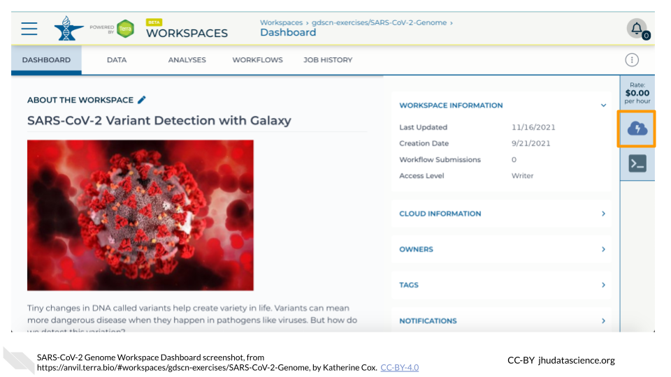
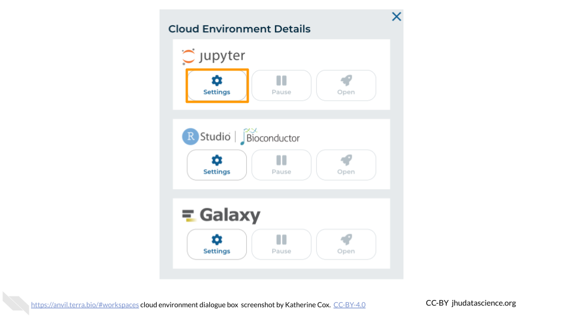
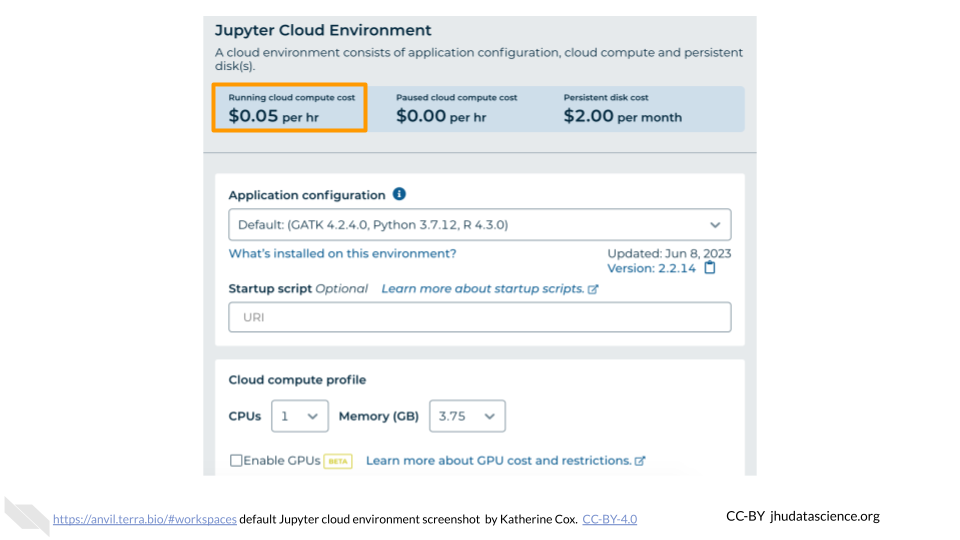
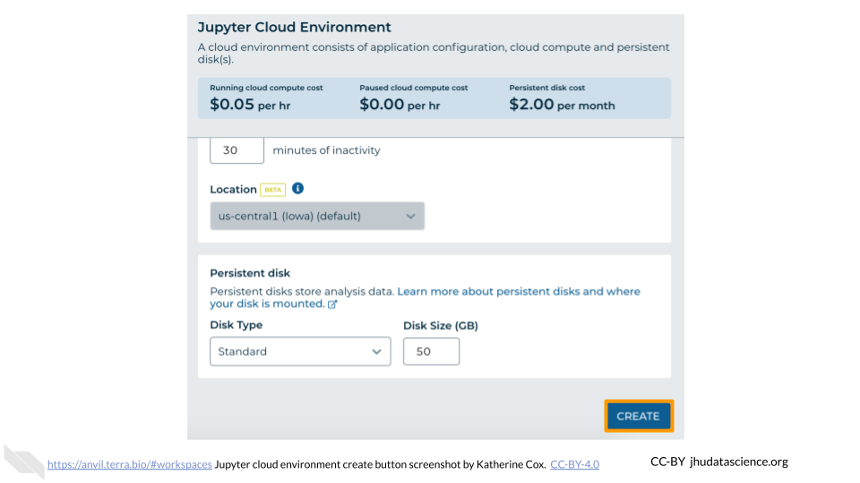
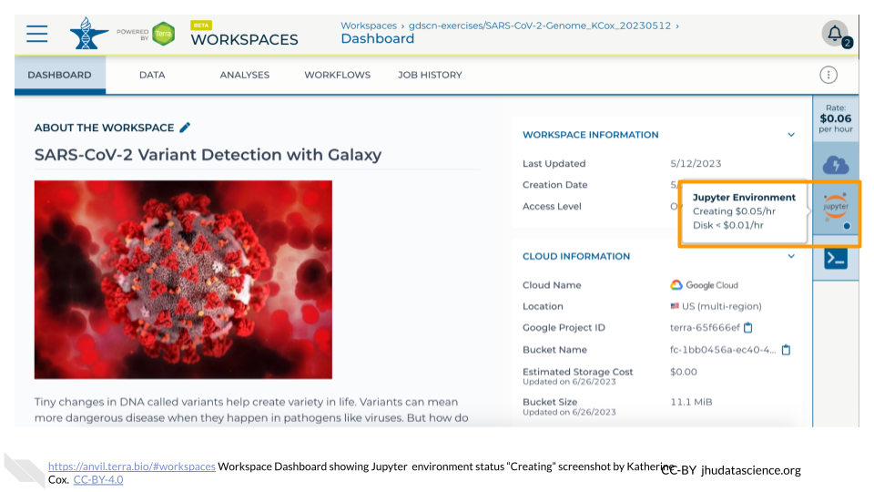
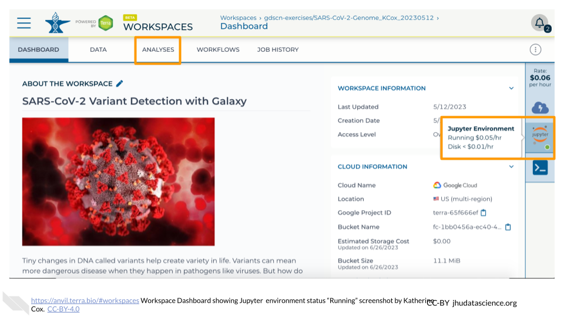
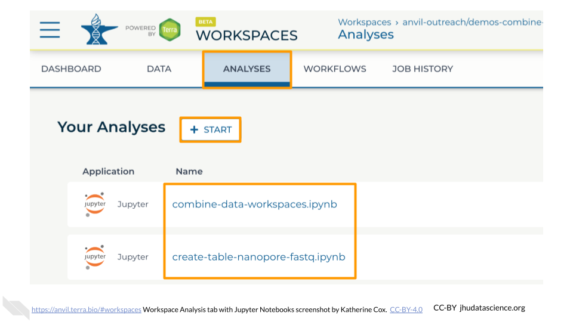
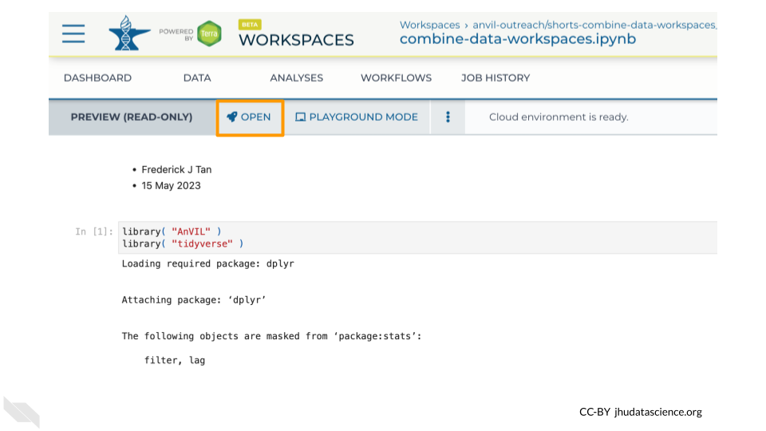

# Jupyter Notebook

One of the analysis platforms available on AnVIL is Jupyter Notebook. This platform offers accessible analysis reports incorporating multiple languages in the case of [Jupyter](https://anvilproject.org/learn/interactive-analysis/getting-started-with-jupyter-notebooks). This chapter focuses on launching and highlighting a few features for Jupyter Notebook.

## Jupyter Notebook: Video tutorial

Here is a video tutorial that describes the basics of using Jupyter Notebook on AnVIL.

<iframe src="https://drive.google.com/file/d/1ZhPYFy4zuAHhPhF6T4pUgSReBmPJM-wg/preview" width="640" height="360" allow="autoplay"></iframe>

### Objectives

- Start compute for your Jupyter environment
- Create notebook to perform analysis
- Stop compute to minimize expenses

### Slides

The slides for this tutorial are are located [here](https://docs.google.com/presentation/d/1GYUP874Qd7K3S0Ls6iWY_M4jywpRb53qw0f78OBCFwk).

## Launching Jupyter Notebook

:::{.warning}
AnVIL is very versatile and can scale up to use very powerful cloud computers. It's very important that you select a cloud computing environment appropriate to your needs to avoid runaway costs.  If you are uncertain, start with the default settings; it is fairly easy to increase your compute resources later, if needed, but harder to scale down.
:::

Note that, in order to use Jupyter, you must have access to a Terra Workspace with permission to compute (i.e. you must be a "Writer" or "Owner" of the Workspace).

1. Open Terra - use a web browser to go to [`anvil.terra.bio`](https://anvil.terra.bio/)

1. In the drop-down menu on the left, navigate to "Workspaces". Click the triple bar in the top left corner to access the menu. Click "Workspaces".

    

1. Click on the name of your Workspace. You should be routed to a link that looks like: `https://anvil.terra.bio/#workspaces/<billing-project>/<workspace-name>`.

1. Click on the cloud icon on the far right to access your Cloud Environment options.  If you don’t see this icon, you may need to scroll to the right.

    

1. In the dialogue box, click the "Settings" button under Jupyter.

    

1. You will see some configuration options for the Jupyter cloud environment, and a list of costs because it costs a small amount of money to use cloud computing.

    

1. Configure any settings you need for your cloud environment.  If you are uncertain about what you need, the default configuration is a reasonable, cost-conservative choice.  It is fairly easy to increase your compute resources later, if needed, but harder to scale down. Scroll down and click the "CREATE" button when you are satisfied with your setup.

    

    

    

    

    

    

    

1. The dialogue box will close and you will be returned to your Workspace.  You can see the status of your cloud environment by hovering over the Jupyter icon.  It will take a few minutes for Terra to request computers and install software.

    

1. When your environment is ready, its status will change to "Running".  Click on the "ANALYSES" tab to create or open a Jupyter Notebook.

    

1. From the ANALYSES tab, you can click on the name of an existing Jupyter Notebook to view and launch it, or click the "START" button to create a new Notebook.

    

1. Clicking on a Notebook name will open a static preview of the Notebook.  To edit and run the Notebook, click the "OPEN" button.

    
