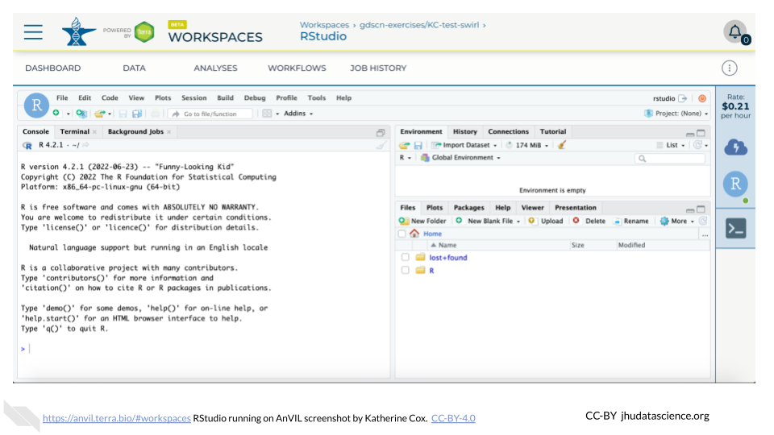

# RStudio

One of the analysis platforms available on AnVIL is RStudio. This platform offers rich genomics support through [Bioconductor](https://anvilproject.org/learn/interactive-analysis/getting-started-with-bioconductor). This chapter focuses on launching and highlighting a few features for RStudio.

## RStudio: Video tutorial


Here is a video tutorial that describes the basics of using RStudio on AnVIL.

<iframe src="https://drive.google.com/file/d/1v72ZG8JIRDUaewFQgGfcCO_qoM4eYmYX/preview" width="640" height="360" allow="autoplay"></iframe>

### Objectives

- Start compute for your RStudio environment
- Tour RStudio on AnVIL
- Stop compute to minimize expenses

### Slides

The slides for this tutorial are are located [here](https://docs.google.com/presentation/d/1eypYLLqD11-NwHLs4adGpcuSB07dYEJfAaALSMvgzqw).

## RStudio: Step-by-step guide

This step-by-step guide provides written instructions and screenshots for getting started with RStudio on AnVIL.


### Launch RStudio Cloud Environment


:::{.warning}
AnVIL is very versatile and can scale up to use very powerful cloud computers. It's very important that you select a cloud computing environment appropriate to your needs to avoid runaway costs.  If you are uncertain, start with the default settings; it is fairly easy to increase your compute resources later, if needed, but harder to scale down.
:::

Note that, in order to use RStudio, you must have access to a Terra Workspace with permission to compute (i.e. you must be a "Writer" or "Owner" of the Workspace).

1. Open Terra - use a web browser to go to [`anvil.terra.bio`](https://anvil.terra.bio/)

1. In the drop-down menu on the left, navigate to "Workspaces". Click the triple bar in the top left corner to access the menu. Click "Workspaces".

    

1. Click on the name of your Workspace. You should be routed to a link that looks like: `https://anvil.terra.bio/#workspaces/<billing-project>/<workspace-name>`.

1. Click on the cloud icon on the far right to access your Cloud Environment options.  If you don’t see this icon, you may need to scroll to the right.

    

1. In the dialogue box, click the "Settings" button under RStudio.

    

1. You will see some configuration options for the RStudio cloud environment, and a list of costs because it costs a small amount of money to use cloud computing.

    


1. Configure any settings you need for your cloud environment.  If you are uncertain about what you need, the default configuration is a reasonable, cost-conservative choice.  It is fairly easy to increase your compute resources later, if needed, but harder to scale down. Scroll down and click the "CREATE" button when you are satisfied with your setup.

    

    

    

    

    

    

    

1. The dialogue box will close and you will be returned to your Workspace.  You can see the status of your cloud environment by hovering over the RStudio icon.  It will take a few minutes for Terra to request computers and install software.

    

1. When your environment is ready, its status will change to "Running".  Click on the RStudio logo to open a new dialogue box that will let you launch RStudio.

    
    
1. Click the launch icon to open RStudio.  This is also where you can pause, modify, or delete your environment when needed.

    

1. You should now see the RStudio interface with information about the version printed to the console.

    

### Tour RStudio


Next, we will be using RStudio and the package `Glimma` to create interactive plots. See [this vignette](https://bioconductor.org/packages/release/bioc/vignettes/Glimma/inst/doc/limma_edger.html) for more information.

1. The Bioconductor team has created a very useful package to programmatically interact with Terra and Google Cloud. Install the `AnVIL` package. It will make some steps easier as we go along.

    

    

1. You can now quickly install precompiled binaries using the AnVIL package’s `install()` function. We will use it to install the `Glimma` package and the `airway` package. The `airway` package contains a `SummarizedExperiment` data class. This data describes an RNA-Seq experiment on four human airway smooth muscle cell lines treated with dexamethasone. 

{Note: for some of the packages, you will have to install packaged from the CRAN repository, using the install.packages() function. The examples will show you which install method to use.}

    

    

1. Load the example data.

    

    

1. The multidimensional scaling (MDS) plot is frequently used to explore differences in samples. When this data is MDS transformed, the first two dimensions explain the greatest variance between samples, and the amount of variance decreases monotonically with increasing dimension. The following code will launch a new window where you can interact with the MDS plot.

    

    

1. Change the `colour_by` setting to "groups" so you can easily distinguish between groups. In this data, the "group" is the treatment.

    

1. You can download the interactive html file by clicking on "Save As".

    

1. You can also download plots and other files created directly in RStudio. To download the following plot, click on "Export" and save in your preferred format to the default directory. This saves the file in your cloud environment.

    

    

1. You should see the plot in the "Files" pane.

    

1. Select this file and click "More" > "Export"

    

1. Select "Download" to save the file to your local machine.

    


### Pause RStudio {#stopping}


1. You can view costs and make changes to your cloud environments from the panel on the far right of the page.  If you don’t see this panel, you may need to scroll to the right.  Running environments will have a green dot, and paused environments will have an orange dot.

    

1. Hovering over the RStudio icon will show you the costs associated with your RStudio environment.  Click on the RStudio icon to open the cloud environment settings.

    

1. Click the Pause button to pause RStudio.  This will take a few minutes.

    

1. When the environment is paused, an orange dot will be displayed next to the RStudio icon.  If you hover over the icon, you will see that it is paused, and has a small ongoing cost as long as it is paused.  When you’re ready to resume working, you can do so by clicking the RStudio icon and clicking Resume.

    

1. The right-hand side icon reminds you that you are accruing cloud computing costs. If you don’t see this icon, you may need to scroll to the right.

    

1. You should minimize charges when you are not performing an analysis. You can do this by clicking on the RStudio icon and selecting “Pause”. This will release the CPU and memory resources for other people to use. Note that your work will be saved in the environment and continue to accrue a very small cost.  This work will be lost if the cloud environment gets deleted.  If there is anything you would like to save permanently, it's a good idea to copy it from your compute environment to another location, such as the Workspace bucket, GitHub, or your local machine, depending on your needs.

    

:::{.notice}
You can also pause your cloud environment(s) at https://anvil.terra.bio/#clusters.
:::

### Delete RStudio Cloud Environment


1. Pausing your cloud environment only temporarily stops your work. When you are ready to delete the cloud environment, click on the RStudio icon on the right-hand side and select “Settings”.  If you don’t see this icon, you may need to scroll to the right.

    

1. Click on “Delete Environment”.

    

1. If you are certain that you do not need the data and configuration on your disk, you should select "Delete everything, including persistent disk".  If there is anything you would like to save, open the compute environment and copy the file(s) from your compute environment to another location, such as the Workspace bucket, GitHub, or your local machine, depending on your needs.

    

1. Select "DELETE".

    

:::{.notice}
You can also delete your cloud environment(s) and disk storage at https://anvil.terra.bio/#clusters.
:::


``` r
sessionInfo()
```

```
## R version 4.3.2 (2023-10-31)
## Platform: x86_64-pc-linux-gnu (64-bit)
## Running under: Ubuntu 22.04.4 LTS
## 
## Matrix products: default
## BLAS:   /usr/lib/x86_64-linux-gnu/openblas-pthread/libblas.so.3 
## LAPACK: /usr/lib/x86_64-linux-gnu/openblas-pthread/libopenblasp-r0.3.20.so;  LAPACK version 3.10.0
## 
## locale:
##  [1] LC_CTYPE=en_US.UTF-8       LC_NUMERIC=C              
##  [3] LC_TIME=en_US.UTF-8        LC_COLLATE=en_US.UTF-8    
##  [5] LC_MONETARY=en_US.UTF-8    LC_MESSAGES=en_US.UTF-8   
##  [7] LC_PAPER=en_US.UTF-8       LC_NAME=C                 
##  [9] LC_ADDRESS=C               LC_TELEPHONE=C            
## [11] LC_MEASUREMENT=en_US.UTF-8 LC_IDENTIFICATION=C       
## 
## time zone: Etc/UTC
## tzcode source: system (glibc)
## 
## attached base packages:
## [1] stats     graphics  grDevices utils     datasets  methods   base     
## 
## loaded via a namespace (and not attached):
##  [1] sass_0.4.8        utf8_1.2.4        generics_0.1.3    xml2_1.3.6       
##  [5] stringi_1.8.3     lattice_0.21-9    hms_1.1.3         digest_0.6.34    
##  [9] magrittr_2.0.3    evaluate_0.23     grid_4.3.2        timechange_0.3.0 
## [13] bookdown_0.40     fastmap_1.1.1     rprojroot_2.0.4   jsonlite_1.8.8   
## [17] Matrix_1.6-1.1    processx_3.8.3    chromote_0.3.1    ps_1.7.6         
## [21] promises_1.2.1    httr_1.4.7        fansi_1.0.6       ottrpal_1.3.0    
## [25] udpipe_0.8.11     cow_0.0.0.9000    jquerylib_0.1.4   cli_3.6.2        
## [29] rlang_1.1.4       gitcreds_0.1.2    cachem_1.0.8      yaml_2.3.8       
## [33] tools_4.3.2       tzdb_0.4.0        dplyr_1.1.4       curl_5.2.0       
## [37] png_0.1-8         vctrs_0.6.5       R6_2.5.1          lifecycle_1.0.4  
## [41] lubridate_1.9.3   snakecase_0.11.1  stringr_1.5.1     janitor_2.2.0    
## [45] pkgconfig_2.0.3   later_1.3.2       pillar_1.9.0      bslib_0.6.1      
## [49] data.table_1.15.0 glue_1.7.0        Rcpp_1.0.12       highr_0.11       
## [53] xfun_0.48         tibble_3.2.1      tidyselect_1.2.0  knitr_1.48       
## [57] textrank_0.3.1    websocket_1.4.2   htmltools_0.5.7   igraph_2.0.2     
## [61] rmarkdown_2.25    webshot2_0.1.1    readr_2.1.5       compiler_4.3.2   
## [65] askpass_1.2.0     openssl_2.1.1
```
