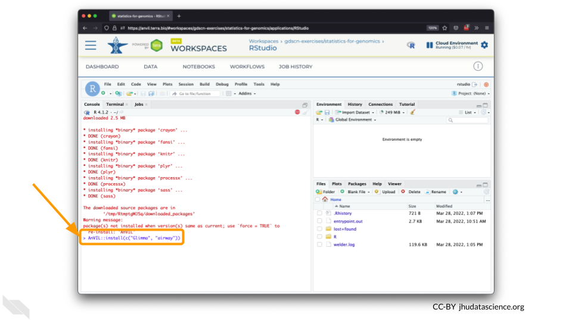
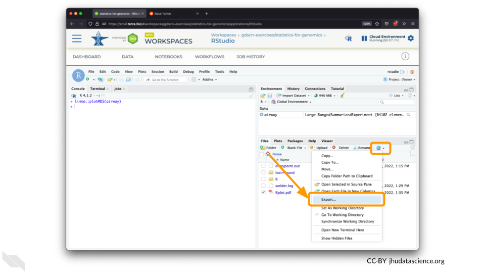

# RStudio

One of the analysis platforms available on AnVIL is RStudio. This platform offers rich genomics support through [Bioconductor](https://anvilproject.org/learn/interactive-analysis/getting-started-with-bioconductor). This chapter focuses on launching and highlighting a few features for RStudio.

## RStudio: Video tutorial


Here is a video tutorial that describes the basics of using RStudio on AnVIL.

<iframe src="https://drive.google.com/file/d/1v72ZG8JIRDUaewFQgGfcCO_qoM4eYmYX/preview" width="640" height="360" allow="autoplay"></iframe>

### Objectives

- Start compute for your RStudio environment
- Tour RStudio on AnVIL
- Stop compute to minimize expenses

### Slides

The slides for this tutorial are are located [here](https://docs.google.com/presentation/d/1eypYLLqD11-NwHLs4adGpcuSB07dYEJfAaALSMvgzqw).

## RStudio: Step-by-step guide

This step-by-step guide provides written instructions and screenshots for getting started with RStudio on AnVIL.


### Launch RStudio Cloud Environment


Note that, in order to use RStudio, you must have access to a Terra Workspace with permission to compute (i.e. you must be a "Writer" or "Owner" of the Workspace).

1. Click on the name of your Workspace. You should be routed to a link that looks like: `https://anvil.terra.bio/#workspaces/<billing-project>/<workspace-name>`.

1. On the top right, Click the gear icon to access your Cloud Environment options.

    

1. You will see a list of costs because it costs a small amount of money to use cloud computing. Click "CUSTOMIZE".

    

1. Click on the first drop down menu to see what other software configurations are available.

    

1. Scroll down and select RStudio from the Community-Maintained RStudio Environments section. **NOTE**: AnVIL is very versatile and can scale up to use very powerful cloud computers. It's very important that you select a cloud computing environment appropriate to your needs to avoid runaway costs.  If you are uncertain, start with the default settings; it is fairly easy to increase your compute resources later, if needed, but harder to scale down.

    

1. Leave everything else as-is. To create your RStudio Cloud Environment, click on the “CREATE” button.

    

1. Your Cloud Environment will be available in a few minutes after the cloud resources are provisioned and your software starts up. The upper right corner displays the status and should say “Creating” while resources are being provisioned.

    

1. After a few minutes, you will see the status change to “Running”.

    

1. Click on the “R” icon to launch RStudio.

    

1. You should now see the RStudio interface with information about the version printed to the console.

    

### Tour RStudio


Next, we will be using RStudio and the package `Glimma` to create interactive plots. See [this vignette](https://bioconductor.org/packages/release/bioc/vignettes/Glimma/inst/doc/limma_edger.html) for more information.

1. The Bioconductor team has created a very useful package to programmatically interact with Terra and Google Cloud. Install the `AnVIL` package. It will make some steps easier as we go along.

    

    

1. You can now quickly install precompiled binaries using the AnVIL package’s `install()` function. We will use it to install the `Glimma` package and the `airway` package. The `airway` package contains a `SummarizedExperiment` data class. This data describes an RNA-Seq experiment on four human airway smooth muscle cell lines treated with dexamethasone. 

{Note: for some of the packages, you will have to install packaged from the CRAN repository, using the install.packages() function. The examples will show you which install method to use.}

    

    

1. Load the example data.

    

    

1. The multidimensional scaling (MDS) plot is frequently used to explore differences in samples. When this data is MDS transformed, the first two dimensions explain the greatest variance between samples, and the amount of variance decreases monotonically with increasing dimension. The following code will launch a new window where you can interact with the MDS plot.

    

    

1. Change the `colour_by` setting to "groups" so you can easily distinguish between groups. In this data, the "group" is the treatment.

    

1. You can download the interactive html file by clicking on "Save As".

    

1. You can also download plots and other files created directly in RStudio. To download the following plot, click on "Export" and save in your preferred format to the default directory. This saves the file in your cloud environment.

    

    

1. You should see the plot in the "Files" pane.

    

1. Select this file and click "More" > "Export"

    

1. Select "Download" to save the file to your local machine.

    


### Pause RStudio {#stopping}


1. The upper right corner reminds you that you are accruing cloud computing costs.

    

1. You should minimize charges when you are not performing an analysis. You can do this by clicking on “Stop cloud environment”. This will release the CPU and memory resources for other people to use. Note that your work will be saved in the environment and continue to accrue a very small cost.  This work will be lost if the cloud environment gets deleted.  If there is anything you would like to save permanently, it's a good idea to copy it from your compute environment to another location, such as the Workspace bucket, GitHub, or your local machine, depending on your needs.

    

### Delete RStudio Cloud Environment


1. Stopping your cloud environment only pauses your work. When you are ready to delete the cloud environment, click on the gear icon in the upper right corner to “Update cloud environment”.

    

1. Click on “Delete Environment Options”.

    

1. If you are certain that you do not need the data and configuration on your disk, you should select "Delete everything, including persistent disk".  If there is anything you would like to save, open the compute environment and copy the file(s) from your compute environment to another location, such as the Workspace bucket, GitHub, or your local machine, depending on your needs.

    

1. Select "DELETE".

    


```r
sessionInfo()
```

```
## R version 4.0.2 (2020-06-22)
## Platform: x86_64-pc-linux-gnu (64-bit)
## Running under: Ubuntu 20.04.3 LTS
## 
## Matrix products: default
## BLAS/LAPACK: /usr/lib/x86_64-linux-gnu/openblas-pthread/libopenblasp-r0.3.8.so
## 
## locale:
##  [1] LC_CTYPE=en_US.UTF-8       LC_NUMERIC=C              
##  [3] LC_TIME=en_US.UTF-8        LC_COLLATE=en_US.UTF-8    
##  [5] LC_MONETARY=en_US.UTF-8    LC_MESSAGES=C             
##  [7] LC_PAPER=en_US.UTF-8       LC_NAME=C                 
##  [9] LC_ADDRESS=C               LC_TELEPHONE=C            
## [11] LC_MEASUREMENT=en_US.UTF-8 LC_IDENTIFICATION=C       
## 
## attached base packages:
## [1] stats     graphics  grDevices utils     datasets  methods   base     
## 
## loaded via a namespace (and not attached):
##  [1] Rcpp_1.0.8        highr_0.8         pillar_1.4.6      compiler_4.0.2   
##  [5] jquerylib_0.1.4   tools_4.0.2       digest_0.6.25     udpipe_0.8.3     
##  [9] evaluate_0.14     lifecycle_1.0.0   tibble_3.0.3      lattice_0.20-41  
## [13] png_0.1-7         pkgconfig_2.0.3   rlang_0.4.10      Matrix_1.2-18    
## [17] igraph_1.2.6      curl_4.3          yaml_2.2.1        xfun_0.26        
## [21] dplyr_1.0.2       stringr_1.4.0     httr_1.4.2        knitr_1.33       
## [25] hms_0.5.3         generics_0.0.2    vctrs_0.3.4       fs_1.5.0         
## [29] gitcreds_0.1.1    rprojroot_2.0.2   grid_4.0.2        tidyselect_1.1.0 
## [33] glue_1.6.1        data.table_1.13.0 R6_2.4.1          cow_0.0.0.9000   
## [37] textrank_0.3.0    ottrpal_0.1.2     rmarkdown_2.10    bookdown_0.24    
## [41] purrr_0.3.4       readr_1.4.0       magrittr_2.0.2    ellipsis_0.3.1   
## [45] htmltools_0.5.0   stringi_1.5.3     crayon_1.3.4
```
