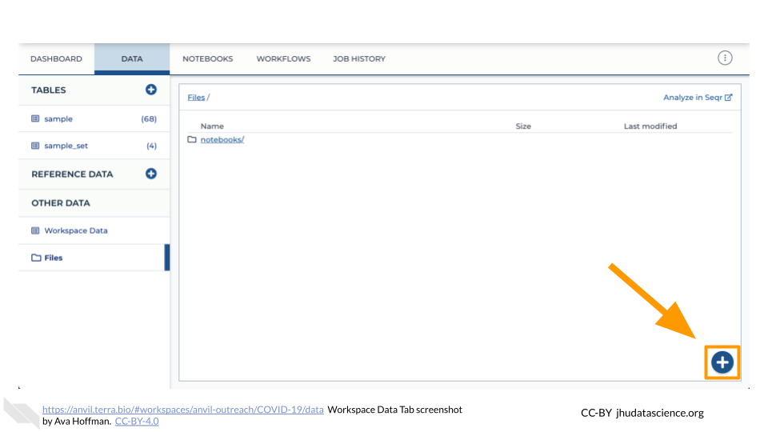

# Data

## Introduction {#introduction-data}

<!------------------------------------------>

## Bring Your Own Data

### Overview {#bring-data-overview}

The starting point for bringing your own data to AnVIL is the Workspace Dashboard. At the bottom right, you'll find the full path to the Google Bucket information corresponding to your Workspace. You can click the clipboard icon on the right to copy the name of your Workspace Bucket. You will be able to see any uploaded files by clicking the "Open in browser" link.


You can also see any uploaded files by clicking the "Files" directory at the bottom left in the Data Tab.


### Browser: Upload Single Files

Click the "Files" directory at the bottom left of the Data Tab. Then click the "+" button in the bottom right corner of the screen. This will prompt a file browser on your local machine.



### Browser: Upload Folders

Click the ["Open in browser"](#bring-data-overview) link on the bottom right of the Workspace Dashboard Tab. This will open a new browser window or tab directed to your Workspace's Google Bucket on the Google Cloud Platform. 


Here, you can upload files and manage your data and folders. You can also upload an entire folder by clicking on "UPLOAD FOLDER".


### `gsutil`: Local to Cloud

`gsutil` is a Python application that lets you access Cloud Storage from the command line in a terminal. The terminal you use can be run on your local machine (local instance) or built into the Workspace Cloud Environment.

#### Install `gsutil` on Your Local Computer or Local Server

[Cloud SDK](https://cloud.google.com/sdk/docs) is a set of tools that you can use to manage resources and applications hosted on Google Cloud. These tools include the `gsutil` command-line tool. 

1. Ensure you have a terminal available. 
    - MacOS and Linux users have a terminal application available by default. Terminal applications are also available through third party software, such as RStudio. 
    - Windows users should download a terminal application, such as [Putty](https://www.chiark.greenend.org.uk/~sgtatham/putty/latest.html).

1. Install Cloud SDK following the appropriate link below:
    - [Windows](https://cloud.google.com/sdk/docs/install#windows)
    - [MacOS](https://cloud.google.com/sdk/docs/install#mac)
    - [Linux](https://cloud.google.com/sdk/docs/install#linux)

1. Test that Cloud SDK has been successfully installed by typing `gsutil` in the terminal application prompt:

```
gsutil
```

If the installation was successful, you should see information about using `gsutil` that looks like the following:

```
Usage: gsutil [-D] [-DD] [-h header]... [-i service_account] [-m] [-o] [-q] [-u user_project] [command [opts...] args...]
```

If the installation was not successful, you should see a warning that `gsutil` was not found. Please return to the installation steps to ensure they have been completed correctly.

```
command not found: gsutil
```

#### Copy Files From Your Local Computer to a Workspace Bucket

The `gsutil cp` command allows you to copy data from one machine to another. On your local machine's terminal, you should use the command in the following format:

```
gsutil cp where_to_copy_data_from/filename where_to_copy_data_to
```

**Example:** To copy the file `test.bam` located on your local computer at `users/name/data/` into the Workspace Bucket `gs://ab5-27x` on the cloud:

```
gsutil cp users/name/data/test.bam gs://ab5-27x
```

Remember that you can easily copy the Workspace Bucket ID using the clipboard button on the [Workspace Dashboard]({#bring-data-overview}). Please see the [`gsutil cp` documentation](https://cloud.google.com/storage/docs/gsutil/commands/cp) for more details, such as how to do parallel multi-threaded/multi-processing copying or copying an entire directory tree. The `gsutil cp` command can also be used to copy files from one Workspace Bucket to another (cloud-to-cloud copying).

<!------------------------------------------>

## Analyze Existing Data

Instead of bringing your own data, you can use existing data on AnVIL. Using the following resources can help you discover data to use in your analyses.

### AnVIL Data Library

In the [Datasets Library](https://anvil.terra.bio/#library/datasets), you can find curated datasets from thousands of participants.


Taking a look at [Featured Workspaces](https://anvil.terra.bio/#library/showcase) can get you started quickly. Remember that when you [clone a Workspace](workspaces.html#clone-workspace), AnVIL automatically cross-links to the original data contained within the Data Tables. 


### AnVIL Dataset Catalog

The [AnVIL Dataset Catalog](https://anvilproject.org/data) provides access to key NHGRI datasets, such as the CCDG (Centers for Common Disease Genomics), CMG (Centers for Mendelian Genomics), eMERGE (Electronic Medical Records and Genomics), as well as other relevant datasets. You will need to [coordinate access](https://anvilproject.org/learn/accessing-data/requesting-data-access) to controlled data.


### Gen3 Data Explorer

The [Gen3 Data Explorer and Data Commons](https://gen3.theanvil.io/) provides their API for data queries and downloads, supporting cross-project analyses.


