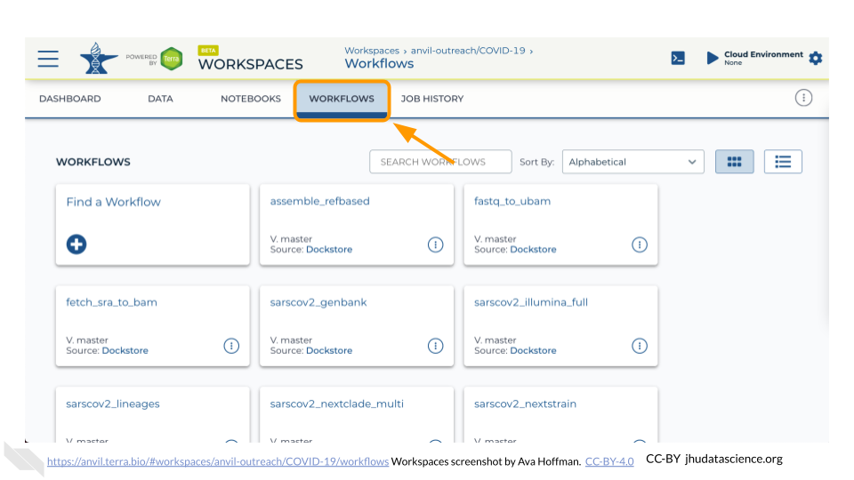

# Workflows

Workflows allow you to run whole genomic pipelines in Terra. Workflows are written in [WDL](https://openwdl.org/#) (Workflow Description Language), which is a human-readable and writable language originally developed for genomic analysis pipelines. Terra on AnVIL is specifically designed to integrate a WDL workflow's input and output information directly into the platform. This integration allows you to easily configure a workflow from your Workspace. Established workflows help make analyses more reproducible. They also make it easier to configure, launch, and monitor analyses across many samples.

You can access workflows from a Workspace by clicking on the Workflows Tab.

To run a workflow you can either use a pre-configured workflow, or create your own workflow.

### Pre-configured Workflow

You will need to clone a Workspace that contains the workflow you'd like to run. Refer to Terra's [quickstart guide](https://support.terra.bio/hc/en-us/articles/360043454592-Workflows-Quickstart-Part-1-Run-pre-configured-workflow) for running a pre-configured workflow. You can browse code and workflows in the AnVIL library [here](https://anvil.terra.bio/#library/code).
    
### Create a Custom Workflow

Custom workflows are written in WDL. Refer to Terra's ["Hello, learn-wdl!"](https://support.terra.bio/hc/en-us/articles/360037117492-Getting-started-with-WDL) tutorial to learn the basics before fully customizing your analysis pipeline.
