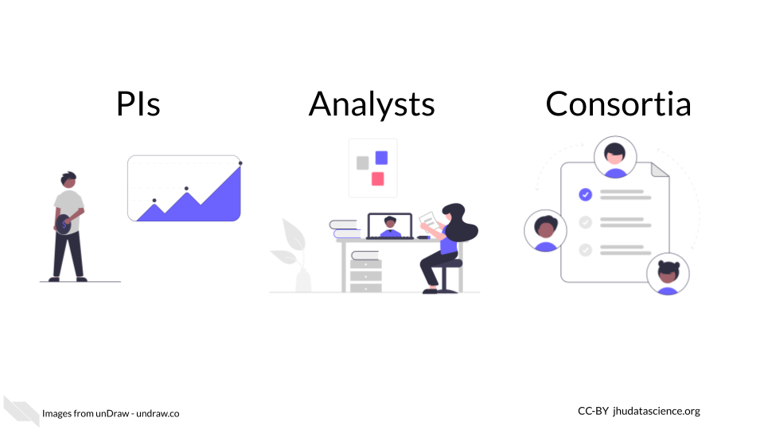

# About this Book {-}

This book is part of a series of books for the NHGRI’s Genomic Data Science Analysis, Visualization, and Informatics Lab-space (AnVIL).  Here, we present opinionated step-by-step guides for setting up accounts focused on three personas: PIs, Analysts, and Consortia.

<!-- -->

Additional guides are provided to help you with Workspaces, launch interactive tools, and start working with data.  Learn more about AnVIL by visiting https://anvilproject.org or reading the [preprint](https://www.biorxiv.org/content/10.1101/2021.04.22.436044v1).

Other books in this series include:

- [Using AnVIL in the Classroom](https://jhudatascience.org/AnVIL_Book_Teacher_Guide)
- Analysis Exercises Using AnVIL
- Galaxy on AnVIL
