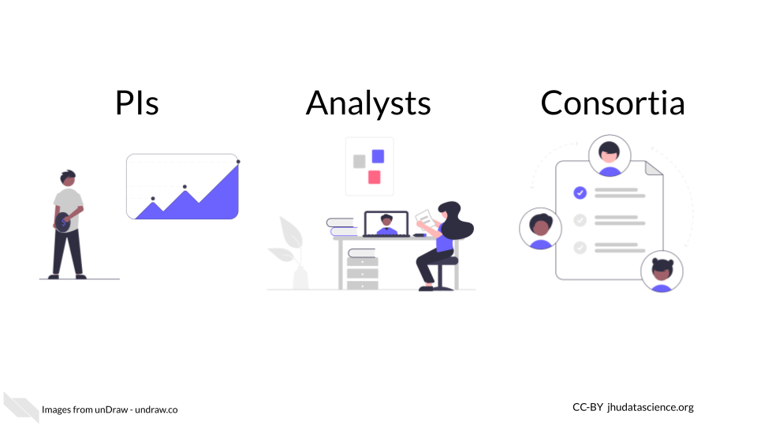
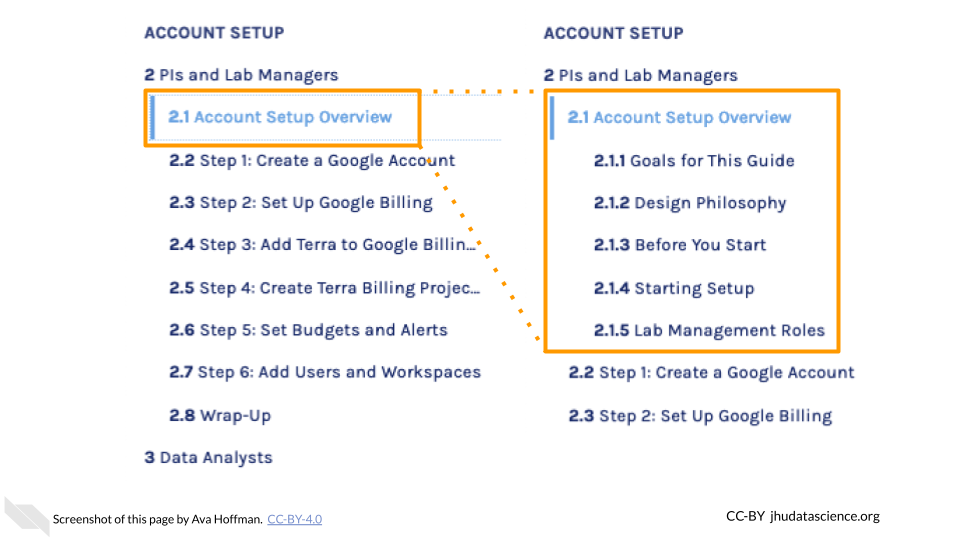

# About this Book {-}

This book is part of a series of books for the Genomic Data Science Analysis, Visualization, and Informatics Lab-space (AnVIL) of the National Human Genome Research Institute (NHGRI). Here, we present opinionated step-by-step guides for setting up accounts focused on three personas: PIs, Analysts, and Consortia.

### Skills Level {-}

Please choose the closest matching persona from the lefthand menu.

::: {.notice}
_Genetics_  

**Novice**: no genetics knowledge needed

_Programming skills_  

**Novice**: no programming experience needed
:::

### How to Use This Book {-}

This book is not intended to be read through sequentially, rather, it is a collection of guides that you can reference based on your needs.  It is divided into two major sections:

**Account Setup**

Step-by-step instructions for new AnVIL users to set up their accounts and start using the AnVIL platform.  We have included recommendations for configuring your accounts based on several common use cases:

- **PIs and Lab Managers**: managing a team of researchers working on AnVIL
- **Data Analysts**: joining a team working on AnVIL
- **Consortia**: using AnVIL as part of a research consortium

**Working on AnVIL**

Examples and walkthroughs of common tasks on the AnVIL platform:

- **Workspaces**: how to create and clone research spaces on AnVIL
- **Tools**: how to run common tools including Jupyter Notebooks, Galaxy, and RStudio
- **Data**: how to find and access AnVIL datasets, as well as upload and manage your own data
- **Workflows**: how to find and run existing automated data processing pipelines, and how to customize and share your own

### Activate `scroll_highlight` Feature {#scroll-highlight} {-}

Note that some sections of this book cover steps in a lot of detail. When navigating the table of contents, you can click subsection (e.g., 2.1, 4.3) headers a second time to expand the table of contents and enable the `scroll_highlight` feature. This can help you follow the separate steps within more clearly.

